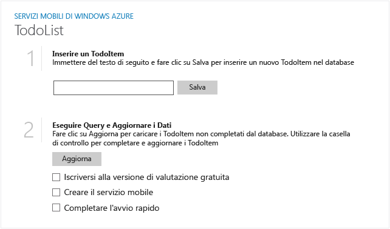
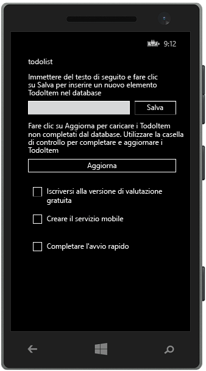

Di seguito sono riportate alcune schermate dell'app completata:

  App di Windows Store

  App di Windows Phone Store

Il completamento di questa esercitazione costituisce un prerequisito per tutte le altre esercitazioni di Servizi mobili relative ad app di Windows Store e Windows Phone Store.

<!---HONumber=62-->