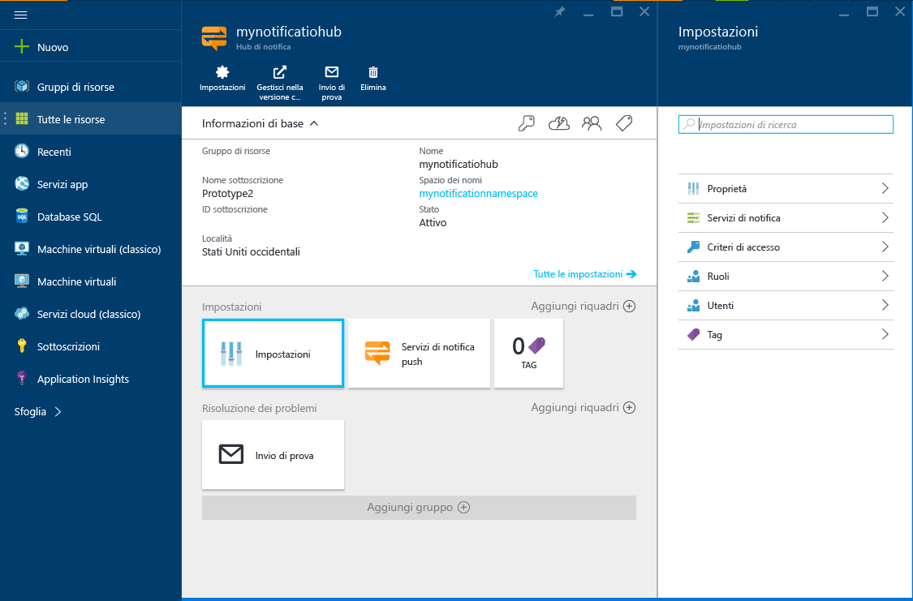

1. Accedere al [portale di Azure](https://portal.azure.com)e quindi fare clic su **+NUOVO** nella parte superiore sinistra della schermata.
2. Fare clic su **Nuovo**, quindi su **Web e dispositivi mobili**. Scorrere verso il basso se necessario, quindi fare clic su **Hub di notifica**.
   
       
3. Assicurarsi di specificare un nome univoco nel campo **Hub di notifica** . Selezionare l'**area**, la **sottoscrizione** e il **gruppo di risorse** desiderati (se già disponibili). 
   
    Se è già disponibile uno spazio dei nomi del bus di servizio in cui creare l'hub, selezionarlo usando l'opzione **Seleziona esistente** nel campo **Spazio dei nomi**.  In caso contrario, usare il nome predefinito che verrà creato in base al nome dell'hub, se tale nome è disponibile. 
   
    Al termine, fare clic su **Crea**.
   
       
4. Dopo aver creato l'hub di notifica e lo spazio dei nomi, sarà possibile accedere alle rispettive pagine del portale. 
   
       
5. Fare clic su **Impostazioni** e quindi su **Criteri di accesso**. Prendere nota delle due stringhe di connessione che saranno disponibili, perché saranno necessarie per la gestione delle notifiche push in un secondo momento.
   
       

<!--HONumber=Nov16_HO2-->

