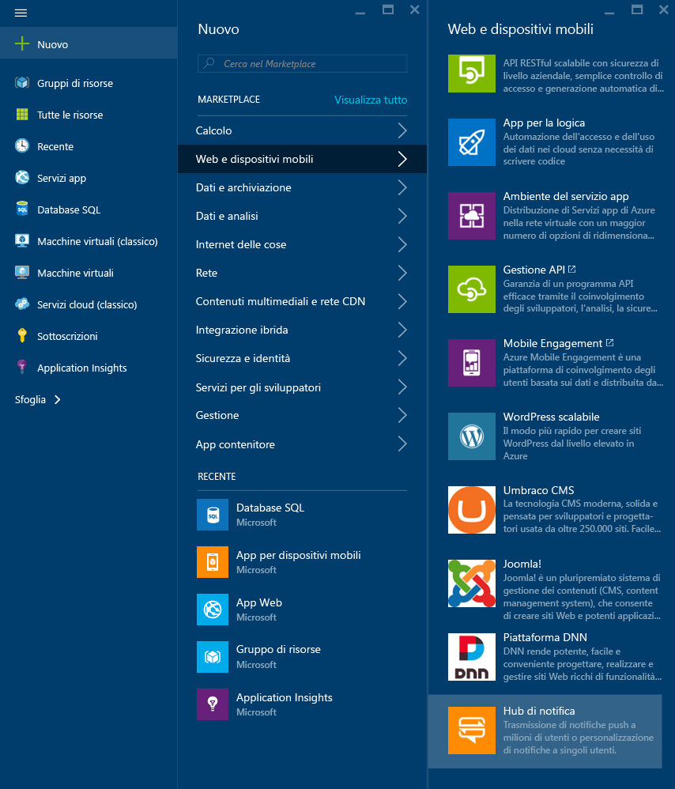
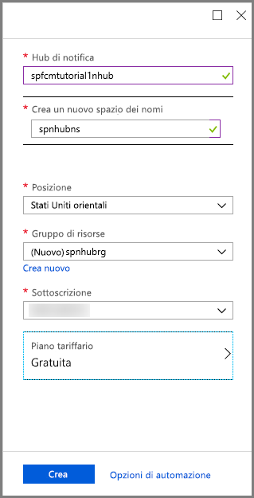
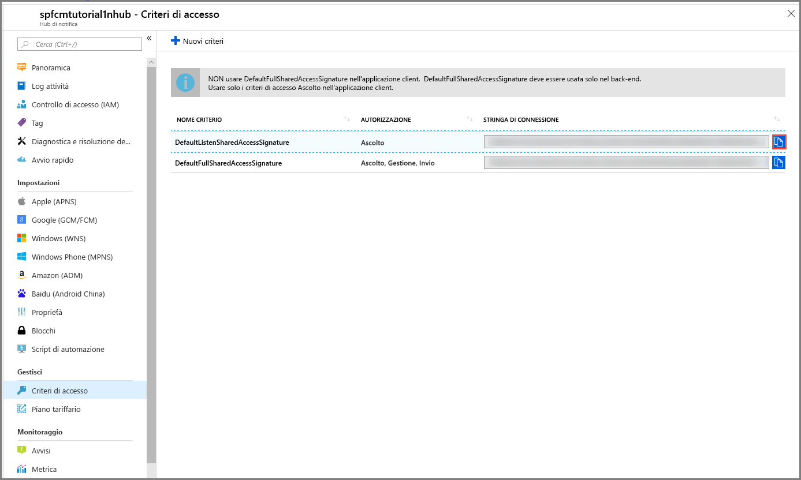

1. Accedere al [portale di Azure](https://portal.azure.com).

2. Selezionare **Crea una risorsa** > **Web e dispositivi mobili** > **Hub di notifica**.
   
      
      
3. Nella casella **Hub di notifica** digitare un nome univoco. Selezionare l'**area**, la **sottoscrizione** e il **gruppo di risorse** (se già disponibili). 
   
      Se non si ha già uno spazio dei nomi del bus di servizio, è possibile usare il nome predefinito, che viene creato in base al nome dell'hub (se lo spazio dei nomi è disponibile).
    
      Se si ha già un spazio dei nomi del bus di servizio in cui si vuole creare l'hub, seguire questa procedura

    a. Nell'area **Spazio dei nomi** selezionare il collegamento **Seleziona esistente**. 
   
    b. Selezionare **Create**.
   
      

4. Dopo avere creato lo spazio dei nomi e l'hub di notifica, aprirlo selezionando **Tutte le risorse** e quindi selezionare l'hub di notifica creato nell'elenco. 
   
      

5. Selezionare **Criteri di accesso** dall'elenco. Prendere nota delle due stringhe di connessione disponibili. Sono necessarie in un secondo momento per gestire le notifiche push.

      >[!IMPORTANT]
      >**NON** usare DefaultFullSharedAccessSignature nell'applicazione. Deve essere usato solo nel back-end.
      >
   
      

