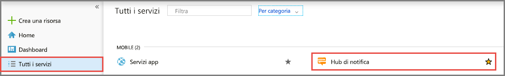
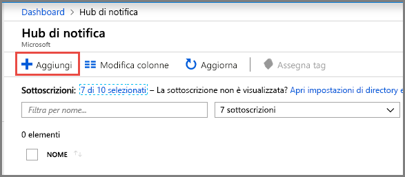
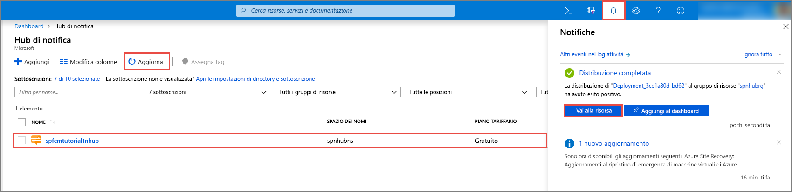

1. Accedere al [portale di Azure](https://portal.azure.com).

1. Scegliere **Tutti i servizi** dal menu a sinistra e quindi selezionare **Hub di notifica** nella sezione **Dispositivi mobili**. Selezionare l'icona a forma di stella accanto al nome del servizio per aggiungere il servizio alla sezione **PREFERITI** nel menu a sinistra. Dopo aver aggiunto **Hub di notifica** a **PREFERITI**, selezionarlo nel menu a sinistra.

      

1. Nella pagina **Hub di notifica** selezionare **Aggiungi** sulla barra degli strumenti.

      

1. Nella pagina **Hub di notifica** procedere come segue:

    1. Immettere un nome in **Hub di notifica**.  

    1. Immettere un nome in **Crea un nuovo spazio dei nomi**. Uno spazio dei nomi contiene uno o più hub.

    1. Selezionare un valore nell'elenco a discesa **Posizione**. Questo valore specifica la posizione in cui creare l'hub.

    1. Selezionare un gruppo di risorse esistente in **Gruppo di risorse** o creare un nome per un nuovo gruppo di risorse.

    1. Selezionare **Create** (Crea).

        

1. Selezionare **Notifiche** (icona a forma di campanello) e quindi selezionare **Vai alla risorsa**. È anche possibile aggiornare l'elenco nella pagina **Hub di notifica** e selezionare l'hub.

      

1. Selezionare **Criteri di accesso** dall'elenco. Prendere nota delle due stringhe di connessione disponibili. Sono necessarie in un secondo momento per gestire le notifiche push.

      >[!IMPORTANT]
      >*Non* usare il criterio **DefaultFullSharedAccessSignature** nell'applicazione. Deve essere usato solo nel back-end.
      >

      
