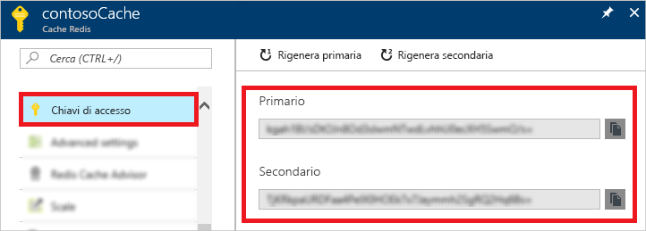
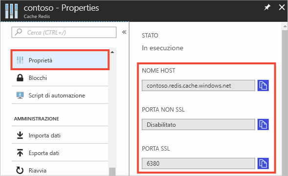

### Recuperare il nome dell'host, le porte e le chiavi di accesso usando il portale di Azure

Per connettersi a un'istanza Cache Redis di Azure è necessario specificare il nome host, le porte e la chiave della cache. Alcuni client possono fare riferimento a questi elementi usando nomi leggermente diversi. Queste informazioni possono essere recuperate nel portale di Azure.

#### Per recuperare le chiavi di accesso e il nome host

1. Per recuperare le chiavi di accesso tramite il [portale di Azure](https://portal.azure.com), individuare la cache e selezionare **Chiavi di accesso**. 

    

2. Per recuperare il nome host e le porte, selezionare **Proprietà**.

    

