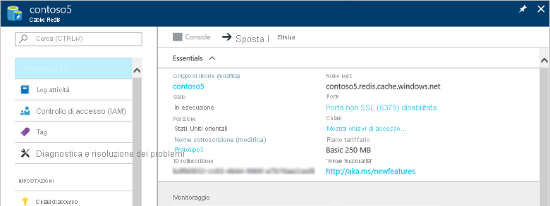

È possibile accedere alle cache nel [portale di Azure](https://portal.azure.com) tramite il pannello **Sfoglia** .

Per visualizzare le cache, fare clic su **More services (Altri servizi) > Cache Redis**. Se è stata visitata di recente una Cache Redis, è possibile fare clic su **Cache Redis** direttamente dall'elenco senza fare clic su **More services** (Altri servizi).

Selezionare la cache desiderata per visualizzarne le proprietà.

Fare clic su **Impostazioni** o su **All settings** (Tutte le impostazioni) per visualizzare e configurare la cache.

<!--HONumber=Nov16_HO2-->

