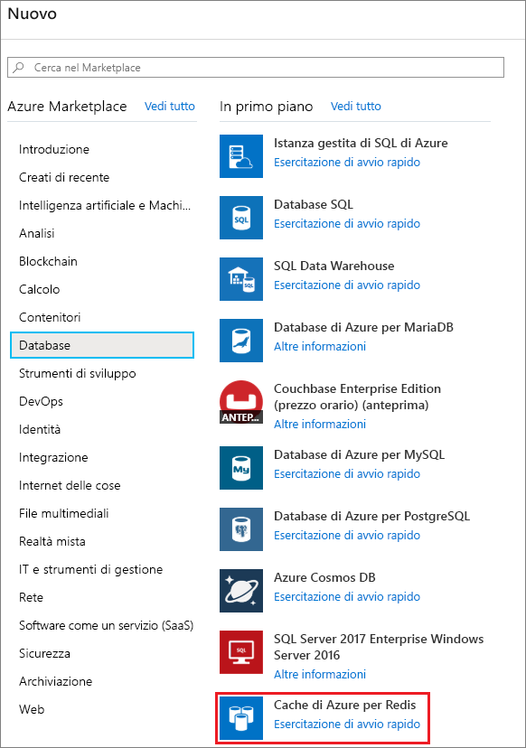
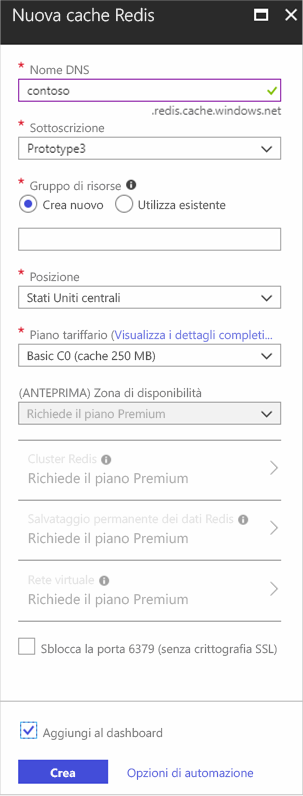
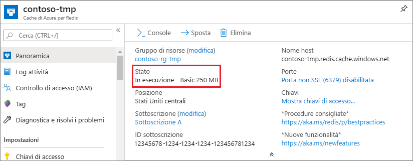

Per creare una cache, accedere al [portale di Azure](https://portal.azure.com) e fare clic su **Nuovo** > **Database** > **Cache Redis**.

> [!NOTE]
> Se non si ha un account Azure, è possibile [creare un account Azure gratuito](https://azure.microsoft.com/pricing/free-trial/?WT.mc_id=redis_cache_hero) in pochi minuti.
> 
> 

> [!NOTE]
> Oltre a creare cache nel portale di Azure, è possibile crearle usando modelli di Resource Manager, PowerShell o l'interfaccia della riga di comando di Azure.
> 
> * Per creare una cache usando i modelli di Resource Manager, vedere [Creare una cache Redis usando un modello](../articles/redis-cache/cache-redis-cache-arm-provision.md).
> * Per creare una cache usando Azure PowerShell, vedere [Gestire Cache Redis di Azure con Azure PowerShell](../articles/redis-cache/cache-howto-manage-redis-cache-powershell.md).
> * Per creare una cache usando l'interfaccia della riga di comando di Azure, vedere [Come creare e gestire Cache Redis di Azure tramite l'interfaccia della riga di comando di Azure (Azure CLI)](../articles/redis-cache/cache-manage-cli.md).
> 
> 

Nel pannello **Nuova cache Redis** specificare la configurazione desiderata per la cache.

 

* In **Nome DNS**immettere il nome univoco di una cache da usare per l'endpoint della cache. Il nome della cache deve essere una stringa contenente da 1 a 63 caratteri che possono includere solo numeri, lettere e il carattere `-` . Il nome della cache non può iniziare o terminare con il carattere `-` e i caratteri `-` consecutivi non sono validi.
* Per **Sottoscrizione**selezionare la sottoscrizione di Azure da usare per la cache. Se l'account ha una sola sottoscrizione, questa verrà selezionata automaticamente e l'elenco a discesa **Sottoscrizione** non verrà visualizzato.
* In **Gruppo di risorse**selezionare o creare un gruppo di risorse per la cache. Per altre informazioni, vedere [Uso di gruppi di risorse per gestire le risorse di Azure](../articles/azure-resource-manager/resource-group-overview.md). 
* Usare **Posizione** per specificare la posizione geografica in cui viene ospitata la cache. Per prestazioni ottimali, è consigliabile creare la cache nella stessa area dell'applicazione client della cache.
* Usare **Piano tariffario** per selezionare le dimensioni e le funzionalità desiderate per la cache.
* **cluster Redis** consente di creare cache con dimensioni maggiori di 53 GB e di partizionare i dati su più nodi Redis. Per altre informazioni, vedere [Come configurare il clustering per una Cache Redis di Azure Premium](../articles/redis-cache/cache-how-to-premium-clustering.md).
* **Persistenza Redis** consente di rendere la cache persistente in un account di archiviazione di Azure. Per istruzioni su come configurare la persistenza, vedere [Come configurare la persistenza per una Cache Redis di Azure Premium](../articles/redis-cache/cache-how-to-premium-persistence.md).
* **Rete virtuale** fornisce isolamento e protezione avanzati limitando l'accesso alla cache ai soli client che si trovano all'interno della rete virtuale di Azure specificata. È possibile utilizzare tutte le funzionalità di rete virtuale, ad esempio subnet, i criteri di controllo di accesso e altre funzionalità per limitare ulteriormente l'accesso a Redis. Per altre informazioni, vedere [Come configurare il supporto di una rete virtuale per una Cache Redis di Azure Premium](../articles/redis-cache/cache-how-to-premium-vnet.md).
* Per le nuove cache la porta senza SSL è disabilitata per impostazione predefinita. Per abilitare la porta non SSL, selezionare **Sblocca la porta 6379 (senza crittografia SSL)**.

Dopo aver configurato le opzioni della nuova cache, fare clic su **Crea**. La creazione della cache può richiedere alcuni minuti. Per verificare lo stato, è possibile monitorare l'avanzamento nella Schermata iniziale. Lo stato della cache dopo la creazione sarà **In esecuzione** e sarà possibile usarla subito con le [impostazioni predefinite](../articles/redis-cache/cache-configure.md#default-redis-server-configuration).

