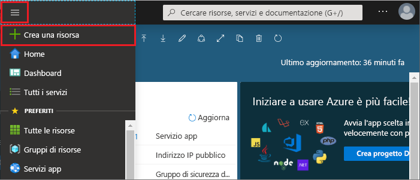

1. Per creare una cache, accedere al [portale di Azure](https://portal.azure.com) e selezionare **Crea una risorsa**. 
   
   
   
1. Nella pagina **Nuovo** selezionare **Database** e quindi **Cache di Azure per Redis**.
   
   
   
1. Nella pagina **Nuova cache Redis** configurare le impostazioni per la nuova cache.
   
   | Impostazione      | Valore consigliato  | Descrizione |
   | ------------ |  ------- | -------------------------------------------------- |
   | **Nome DNS** | Immettere un nome univoco globale. | Il nome della cache deve essere una stringa compresa tra 1 e 63 caratteri contenente solo numeri, lettere o trattini. Il nome deve iniziare e terminare con un numero o una lettera e non può contenere trattini consecutivi. Il *nome host* dell'istanza della cache sarà *\<DNS name>.redis.cache.windows.net*. | 
   | **Sottoscrizione** | Nell'elenco a discesa selezionare la sottoscrizione. | Sottoscrizione in cui creare la nuova istanza della cache di Azure per Redis. | 
   | **Gruppo di risorse** | Nell'elenco a discesa selezionare un gruppo di risorse oppure scegliere **Crea nuovo** e immettere il nome di un nuovo gruppo di risorse. | Nome del gruppo di risorse in cui creare la cache e altre risorse. L'inserimento di tutte le risorse di un'app in un unico gruppo di risorse ne semplifica la gestione o l'eliminazione. | 
   | **Posizione** | Nell'elenco a discesa selezionare una località. | Selezionare un'[area](https://azure.microsoft.com/regions/) in prossimità di altri servizi che useranno la cache. |
   | **Piano tariffario** | Nell'elenco a discesa selezionare un [piano tariffario](https://azure.microsoft.com/pricing/details/cache/). |  Il piano tariffario determina le dimensioni, le prestazioni e le funzionalità disponibili per la cache. Per altre informazioni, vedere la [panoramica su Cache Redis di Azure](../articles/azure-cache-for-redis/cache-overview.md). |
   
1. Selezionare **Create** (Crea). 
   
    
   
   > [!NOTE]
   > Il provisioning della cache richiederà presumibilmente circa 15-20 minuti.   
   
   È possibile monitorare lo stato di avanzamento nella pagina **Panoramica** della cache di Azure per Redis. Quando l'elemento **Stato** indica **In esecuzione**, la cache è pronta per l'uso.
   
   

