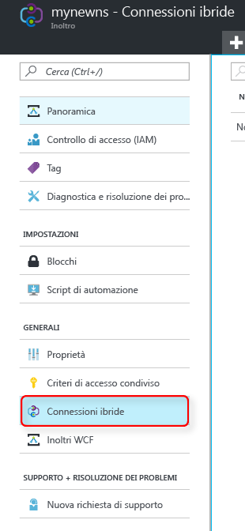
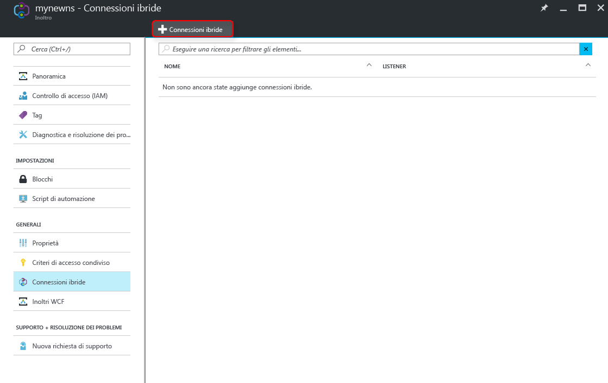
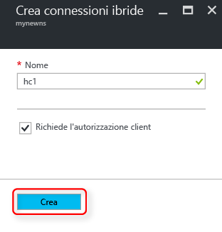

Verificare che sia già stato creato uno spazio dei nomi di inoltro, come illustrato [qui][namespace-how-to].

1. Accedere al [portale di Azure](https://portal.azure.com).
2. Nel pannello di navigazione sinistro del portale fare clic su **Tutte le risorse**.
3. Selezionare lo spazio dei nomi in cui si vuole creare la connessione ibrida. In questo caso è **mynewns**.
   
4. Nel pannello **Relay namespace** (Spazio dei nomi dell'inoltro) selezionare **Connessioni ibride**.

    

5. Nella finestra della panoramica dello spazio dei nomi, fare clic su **+ Connessione ibrida**
   
    
5. Immettere il **Nome connessione ibrida** e lasciare invariati gli altri valori.
   
    
6. Fare clic su **Crea**nella parte inferiore della finestra di dialogo.

[namespace-how-to]: ../articles/service-bus-relay/relay-create-namespace-portal.md 