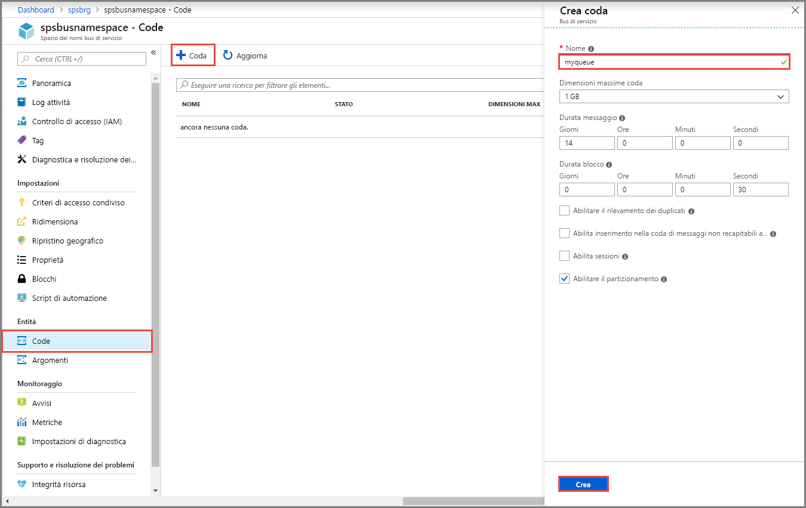

## Creare una coda nel portale di Azure
1. Nella pagina **Spazio dei nomi del bus di servizio** scegliere **Code** dal menu di spostamento a sinistra.
1. Nella pagina **Code** selezionare **+ Coda** sulla barra degli strumenti.
1. Immettere un **nome** per la coda e lasciare le impostazioni predefinite per gli altri valori.
1. Selezionare quindi **Crea**.
 
    

