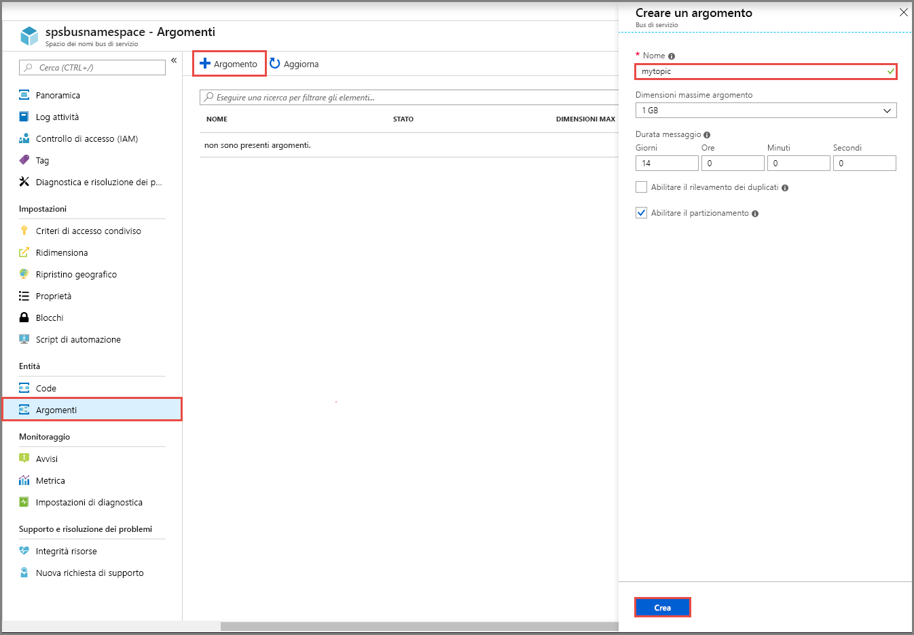
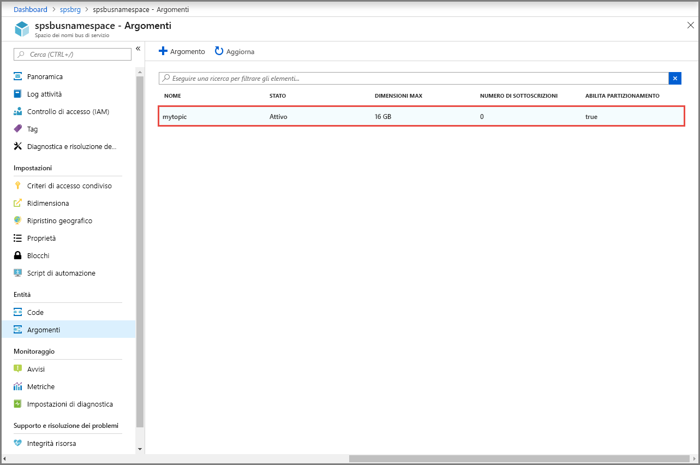
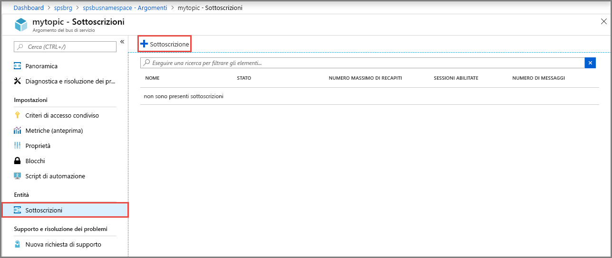

## Creare un argomento usando il portale di Azure
1. Nella pagina **Spazio dei nomi del bus di servizio** scegliere **Argomenti** dal menu a sinistra.
2. Selezionare **+ Argomento** sulla barra degli strumenti. 
4. Immettere un **nome** per l'argomento. Lasciare invariati i valori predefiniti delle altre opzioni.
5. Selezionare **Create** (Crea).

    

## Creare le sottoscrizioni dell'argomento
1. Selezionare l'**argomento** creato nella sezione precedente. 
    
    
2. Nella pagina **Argomento del bus di servizio** scegliere **Sottoscrizioni** dal menu a sinistra e quindi selezionare **+ Sottoscrizione** sulla barra degli strumenti. 
    
    
3. Nella pagina **Crea sottoscrizione** immettere **S1** come **Nome** per la sottoscrizione e quindi selezionare **Crea**. 

    
4. Ripetere due volte il passaggio precedente per creare le sottoscrizioni denominate **S2** ed **S3**.