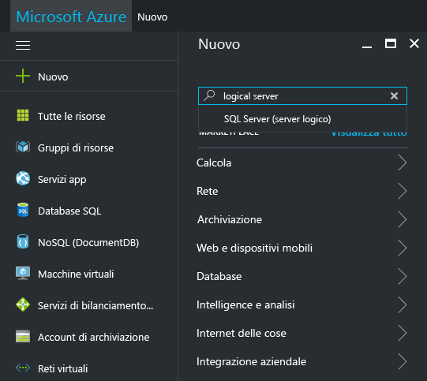
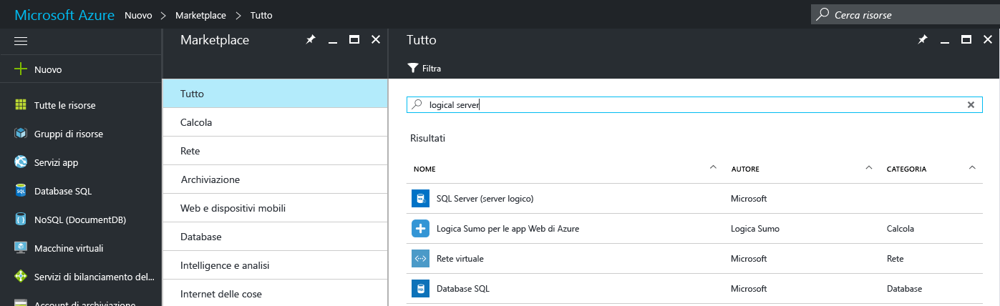
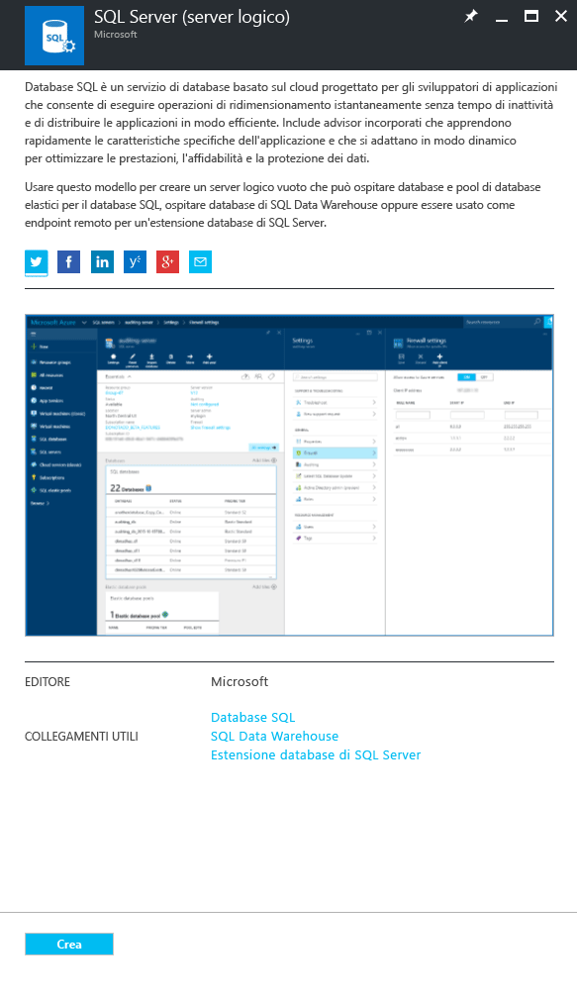
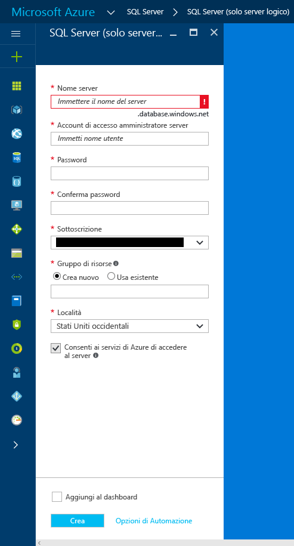
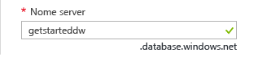
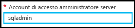
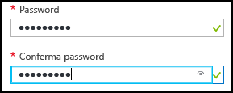
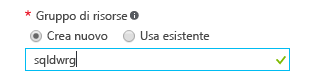

### Creare un nuovo server logico di SQL nel portale di Azure

1. Fare clic su **Nuovo**, cercare **server logico** e quindi premere **INVIO**.

    
2. Selezionare **SQL Server (server logico)**. 

    
  
3. Fare clic su **Crea** per aprire il nuovo pannello SQL Server (server logico).

   <kbd>  </kbd> <kbd> </kbd>
  
3. Nella casella di testo Nome server del pannello SQL Server (server logico) specificare un nome valido per il nuovo server logico. Un segno di spunta verde indica che è stato specificato un nome valido.
    
    

    > [!IMPORTANT]
    > Il nome completo per il nuovo server sarà <nome_server>.database.windows.net.
    >
    
4. Nella casella di testo Account di accesso amministratore server specificare un nome utente per l'account di accesso con autenticazione SQL per questo server. Questo è noto come account di accesso dell'entità server. Un segno di spunta verde indica che è stato specificato un nome valido.
    
    
5. Nelle caselle di testo **Password** e **Conferma password** specificare una password per l'account di accesso dell'entità server. Un segno di spunta verde indica che è stata specificata una password valida.
    
    
6. Selezionare una sottoscrizione in cui si dispone dell'autorizzazione per creare oggetti.

    
7. Nella casella di testo Gruppo di risorse selezionare **Crea nuovo** e quindi, nella casella di testo Gruppo di risorse, specificare un nome valido per il nuovo gruppo di risorse (è inoltre possibile usare un gruppo di risorse esistente se ne è già stato creato uno). Un segno di spunta verde indica che è stato specificato un nome valido.

    

8. Nella casella di testo **Località** selezionare un data center adatto alla propria località, ad esempio "Australia orientale".
    
    
    
    > [!TIP]
    > La casella di controllo **Consenti ai servizi di Azure di accedere al server** non può essere modificata in questo pannello. È possibile modificare questa impostazione nel pannello firewall del server. Per altre informazioni, vedere [Get started with security](../articles/sql-database/sql-database-manage-servers-portal.md) (Introduzione alla sicurezza).
    >
    
9. Fare clic su **Create**.

    

