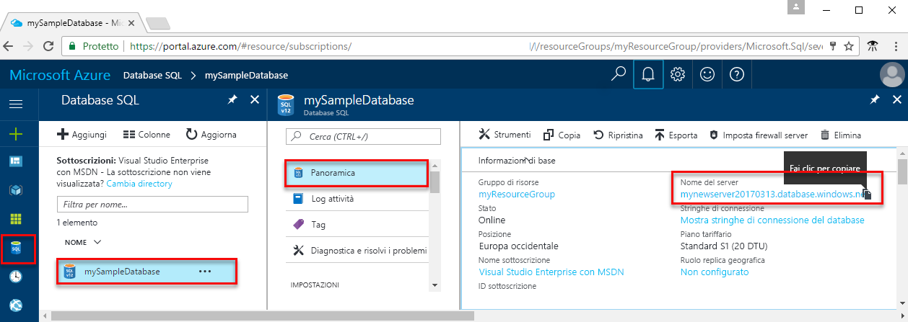

<!-- sql-database-connect-query-prerequisites-server-connection-info-includes.md 

## Get SQL server connection information
-->

Ottenere le informazioni di connessione necessarie per connettersi al database SQL di Azure. Nelle procedure successive saranno necessari il nome completo del server, il nome del database e le informazioni di accesso.

1. Accedere al [portale di Azure](https://portal.azure.com/).

1. Scegliere **database SQL** dal menu a sinistra, quindi scegliere il database nella pagina **database SQL**.

1. Nella pagina **Panoramica** del database, esaminare il nome completo del server accanto a **Nome del server**. Per copiare il nome del server, passare il mouse su di esso e selezionare l'icona **Copia**.  

Se si dimenticano le informazioni di accesso, selezionare il nome del server per aprire la pagina **SQL server**. Qui è possibile visualizzare il nome dell'**Amministratore del server** e selezionare **Reimposta password** se necessario.