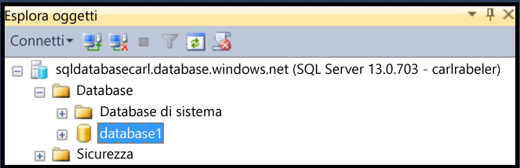
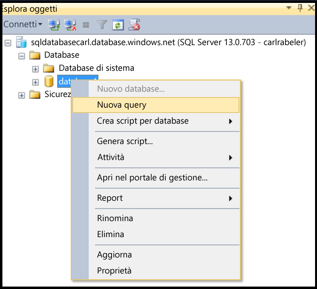
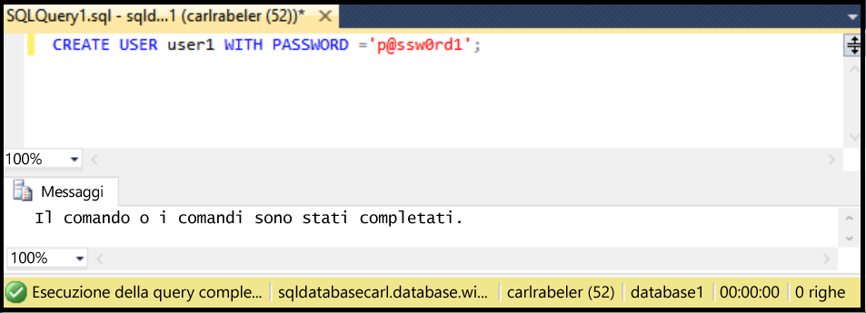

## Creare un nuovo utente del database con SSMS

Usare la procedura seguente per creare un nuovo utente del database in un database esistente tramite SSMS.

Questa procedura presuppone che l'utente sia connesso al database SQL in Esplora oggetti tramite SSMS e al server logico del database SQL come amministratore entità di livello server o con un account utente con le autorizzazioni per creare un nuovo utente.

1. In Esplora oggetti espandere il nodo Database e selezionare il database in cui si vuole creare un nuovo account utente.

     

2. Fare clic con il pulsante destro del mouse sul database selezionato e quindi scegliere **Query**.

     

3. Nella finestra della query modificare e usare l'istruzione Transact-SQL seguente per creare un utente contenuto nel database utente.

    ```CREATE USER user1 WITH PASSWORD ='p@ssw0rd1';

     

<!---HONumber=AcomDC_0504_2016-->