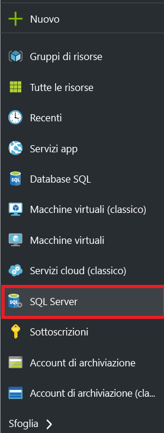
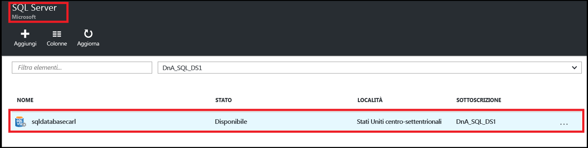
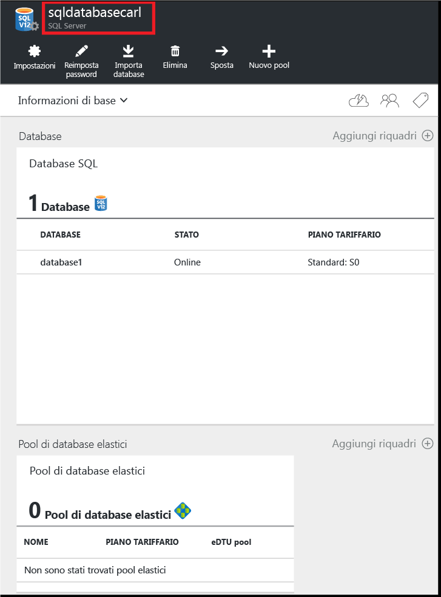
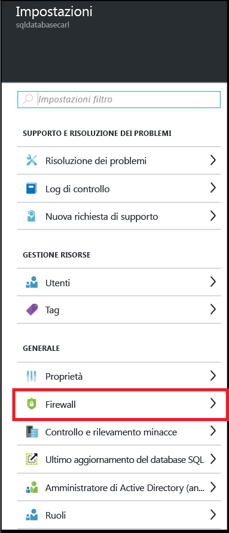
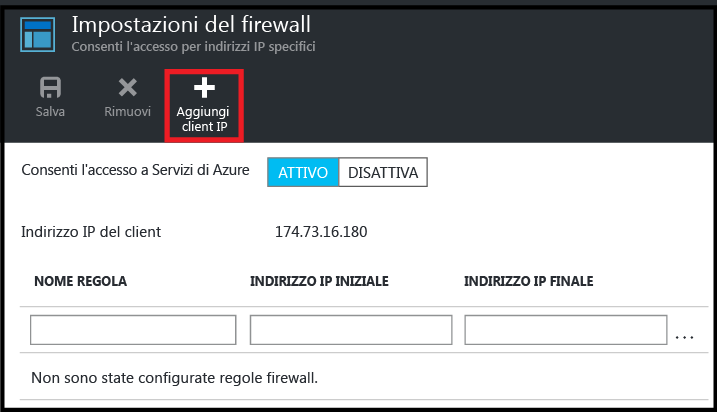
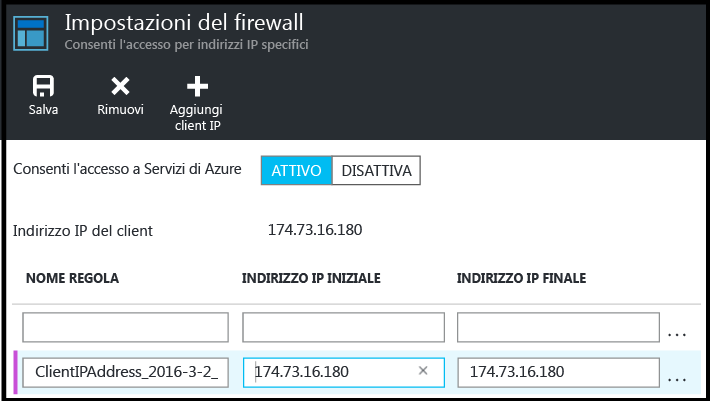
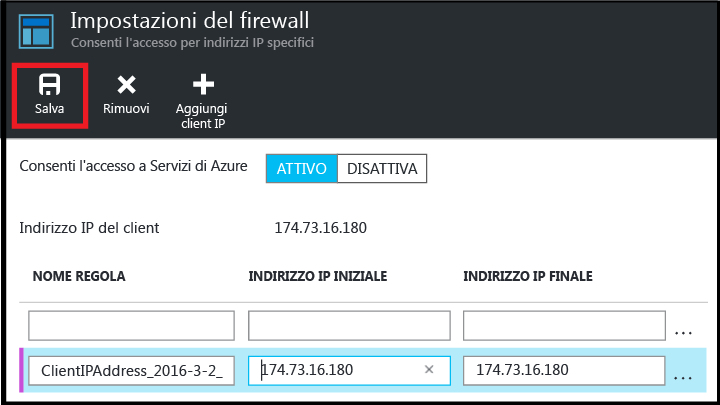

<!--
includes/sql-database-create-new-server-firewall-portal.md

Latest Freshness check:  2016-04-11 , carlrab.

As of circa 2016-04-11, the following topics might include this include:
articles/sql-database/sql-database-get-started-tutorial.md
articles/sql-database/sql-database-configure-firewall-settings

-->
## Creare un nuovo firewall a livello di server di database SQL Azure

Usare la procedura seguente nel portale di Azure per creare una regola del firewall a livello di server che consente le connessioni da un singolo indirizzo IP, il computer client, o un intero intervallo di indirizzi IP a un server logico di database SQL.

1. Se non si è già connessi, accedere al [portale di Azure](http://portal.azure.com).
2. Nel pannello predefinito fare clic su **SQL Server**.

  	

2. Nel pannello SQL Server fare clic sul server di database SQL in cui creare la regola del firewall.

 	
           
3. Esaminare le proprietà del server.

 	
      
4. Nel pannello Impostazioni fare clic su **Firewall**.

 	
    
5. Fare clic su **Aggiungi IP client** per consentire ad Azure di creare una regola per l'indirizzo IP del client specificato.

      

6. Facoltativamente, fare clic sull'indirizzo IP aggiunto per modificare l'indirizzo del firewall e consentire l'accesso a un intervallo di indirizzi IP.

      
    
7. Fare clic su **Salva** per creare la regola del firewall a livello di server.

     

	>[AZURE.IMPORTANT] È possibile che l'indirizzo IP client cambi nel tempo. In questo caso, non sarà possibile accedere al server fino a quando non viene creata una nuova regola firewall. Per verificare il proprio indirizzo IP, usare [Bing](http://www.bing.com/search?q=my%20ip%20address) e quindi aggiungere un singolo indirizzo IP o un intervallo di indirizzi IP. Per altre informazioni, vedere [Gestire le impostazioni del firewall](sql-database-configure-firewall-settings.md#manage-existing-server-level-firewall-rules-through-the-azure-portal).

<!---HONumber=AcomDC_0420_2016-->