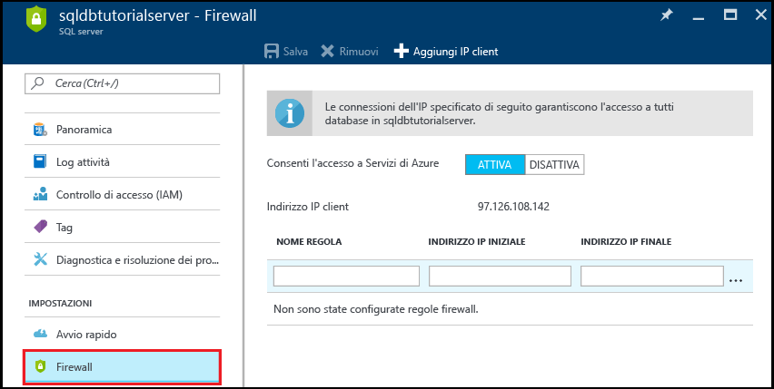
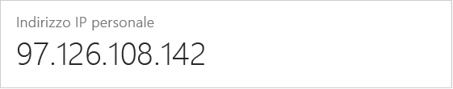
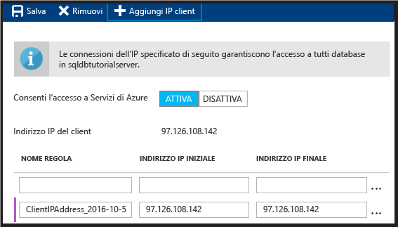
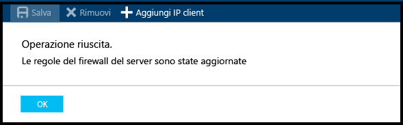

<!--
includes/sql-database-create-new-server-firewall-portal.md

Latest Freshness check:  2016-11-28 , rickbyh.

As of circa 2016-04-11, the following topics might include this include:
articles/sql-database/sql-database-get-started.md
articles/sql-database/sql-database-configure-firewall-settings
articles/sql-data-warehouse-get-started-provision.md

-->
## Creare una regola del firewall a livello di server nel portale di Azure

1. Nel pannello di SQL Server, in Impostazioni, fare clic su **Firewall** per aprire il pannello del firewall per SQL Server.

    
    
2. Verificare la presenza dell'indirizzo IP del client e che questo sia l'indirizzo IP Internet che usa un browser di propria scelta (chiedere "qual è l'indirizzo IP in uso"). Talvolta non corrispondono per varie ragioni.

    

3. Supponendo che gli indirizzi IP corrispondano, fare clic su **Aggiungi IP client** sulla barra degli strumenti.

    

    > [!NOTE]
    > È possibile aprire il firewall del database SQL nel server a un singolo indirizzo IP o a un intero intervallo di indirizzi. L'apertura del firewall consente agli amministratori SQL e agli utenti di accedere a qualsiasi database nel server per cui hanno credenziali valide.
    >

4. Fare clic su **Salva** sulla barra degli strumenti per salvare questa regola del firewall a livello di server e quindi fare clic su **OK**.

    

> [!Tip]
> Per un'esercitazione, vedere [Esercitazione sul database SQL: creare un server, una regola del firewall a livello di server, un database di esempio, una regola del firewall a livello di database ed eseguire la connessione ad SQL Server](../articles/sql-database/sql-database-get-started.md).    
>

<!--HONumber=Jan17_HO1-->

