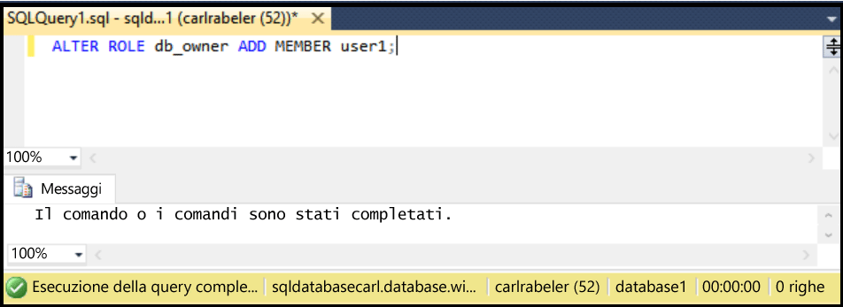

## Concedere autorizzazioni db\_owner a un nuovo utente del database
Usare la procedura seguente per concedere autorizzazioni db\_owner a un utente del database esistente

Questa procedura presuppone che l'utente sia connesso al database SQL in Esplora oggetti con SSMS e al server logico del database SQL come amministratore entità di livello server o con un account utente con le autorizzazioni necessarie per concedere autorizzazioni utente.

1. In Esplora oggetti espandere il nodo Database e selezionare il database con l'utente a cui si vogliono concedere le autorizzazioni dbo.
   
     
2. Fare clic con il pulsante destro del mouse sul database selezionato e quindi scegliere **Query**.
   
     
3. Nella finestra della query modificare e usare l'istruzione Transact-SQL seguente per concedere le autorizzazioni dbo a un utente specificato.
   
    ```ALTER ROLE db_owner ADD MEMBER user1;
    ```
   
     

<!---HONumber=AcomDC_0629_2016-->