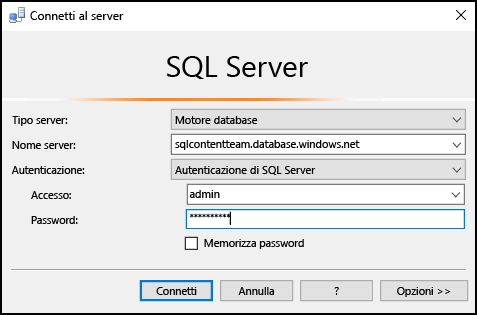
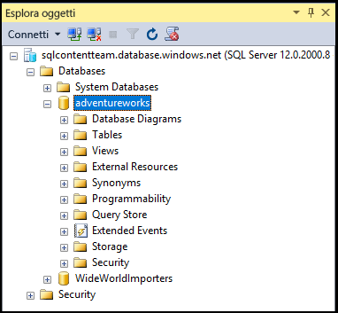

## Connettersi a un database SQL di Azure con l'autenticazione SQL Server

I passaggi seguenti illustrano come connettersi a un server e a un database SQL di Azure con SSMS. Se il server e il database non sono presenti, vedere [Esercitazione sul database SQL: Creare un database SQL in pochi minuti usando il portale di Azure](../articles/sql-database/sql-database-get-started.md) per crearli.

1. Per avviare SSMS digitare **Microsoft SQL Server Management Studio** nella casella di ricerca di Windows e quindi fare clic sull'app desktop.

2. Nella finestra **Connetti al server** immettere le informazioni seguenti. Se SSMS è già in esecuzione, fare clic su **Connetti > Motore di database** per aprire la finestra **Connetti al server**:

 - **Tipo di server**: il valore predefinito è il motore di database. Non modificarlo.
 - **Nome server**: immettere il nome completo del server di database SQL di Azure nel formato seguente: *&lt;nomeserver>*.**database.windows.net**
 - **Tipo di autenticazione**: questo articolo illustra come connettersi usando l'**autenticazione SQL Server**. Per dettagli sulla connessione con Azure Active Directory, vedere [Connettesi usando l'autenticazione integrata di Active Directory](../articles/sql-database/sql-database-aad-authentication.md#connect-using-active-directory-integrated-authentication), [Connettersi usando l'autenticazione della password di Active Directory](../articles/sql-database/sql-database-aad-authentication.md#connect-using-active-directory-password-authentication) e [Connessione tramite l'autenticazione universale con SSMS](../articles/sql-database/sql-database-ssms-mfa-authentication.md).
 - **Nome utente**: immettere il nome di un utente con accesso a un database nel server, ad esempio l'*amministratore del server* configurato durante la creazione del server.
 - **Password**: immettere la password per l'utente specificato, ad esempio la *password* impostata durante la creazione del server.
   
       

3. Fare clic su **Connect**.
 
4. Per impostazione predefinita, i nuovi server non hanno [regole del firewall](../articles/sql-database/sql-database-firewall-configure.md) definite, quindi i client non possono inizialmente connettersi. Se il server non ha ancora una regola del firewall per consentire all'indirizzo IP di connettersi, SSMS chiederà di creare una regola del firewall a livello di server.

    Fare clic su **Accedi** e creare la regola del firewall a livello di server. È necessario essere un amministratore di Azure per creare una regola del firewall a livello di server.
 
       
 

5. Dopo aver stabilito la connessione al database SQL di Azure, si aprirà **Esplora oggetti** e sarà possibile accedere al database per [eseguire attività amministrative o query sui dati](../articles/sql-database/sql-database-manage-azure-ssms.md).
 
     
 
     
## Risolvere i problemi relativi agli errori di connessione

Le cause più comuni degli errori di connessione sono errori nel nome del server e problemi di connettività di rete. Tenere presente che <*nomeserver*> è il nome del server, non del database e che è necessario specificare il nome server completo: `<servername>.database.windows.net`

Verificare anche che il nome utente e la password non contengano eventuali errori di digitazione o spazi aggiuntivi. I nomi utente non fanno distinzione tra maiuscole e minuscole, mentre le password sì.

È anche possibile impostare esplicitamente il protocollo e il numero di porta con il nome server come segue: `tcp:servername.database.windows.net,1433`

Anche i problemi di connettività di rete possono causare errori di connessione e timeout. Il problema può essere a volte risolto semplicemente provando di nuovo a connettersi dopo aver verificato che nome server, credenziali e regole del firewall siano corretti.

<!---HONumber=AcomDC_0824_2016-->