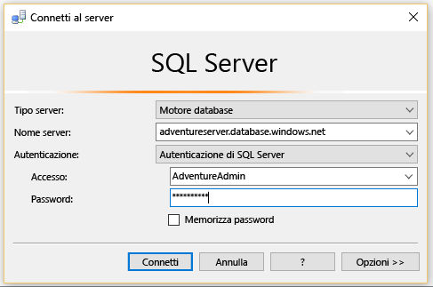
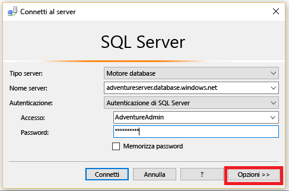
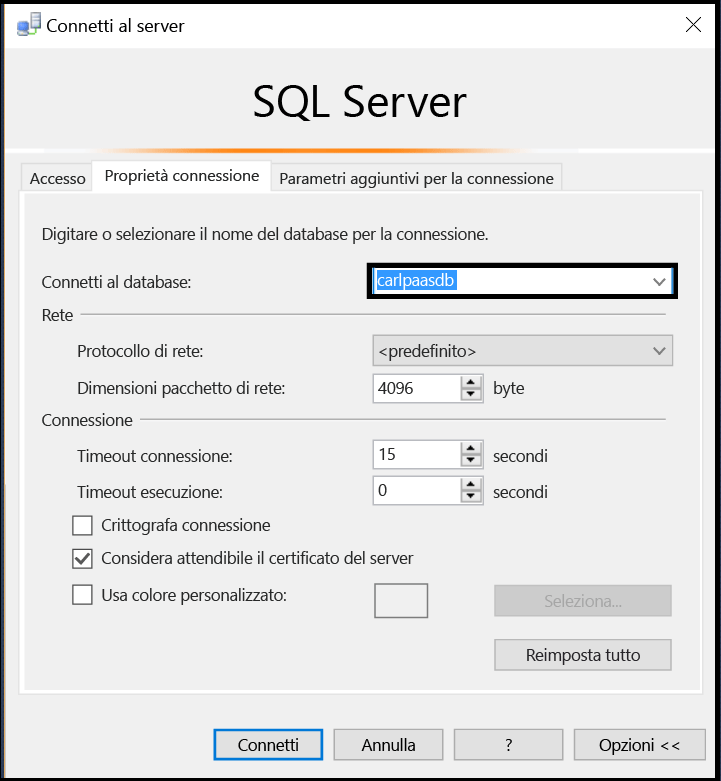
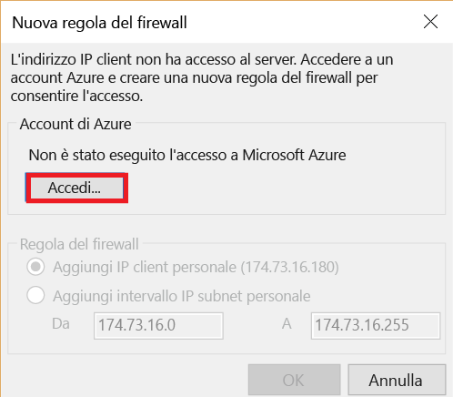
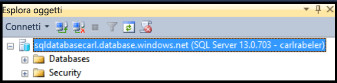

## Connettersi a un database SQL di Azure come utente
Usare i passaggi seguenti per connettersi al database SQL di Azure con SSMS come utente.

1. Digitare "Microsoft SQL Server Management Studio" nella casella di ricerca di Windows e quindi fare clic sull'applicazione desktop per avviare SSMS.
2. Nella finestra Connetti al server immettere le informazioni seguenti:

* **Tipo di server**: il valore predefinito è il motore di database. Non modificarlo.
  
  * **Nome server**: immettere il nome del server che ospita il database SQL nel formato *&lt;nomeserver>*.**database.windows.net**
  * **Tipo di autenticazione**: se si sta iniziando, selezionare Autenticazione SQL. Se si è abilitato Active Directory per il server logico del database SQL, è possibile selezionare Autenticazione della password Active Directory o Autenticazione integrata di Active Directory.
  * **Nome utente**: se si è selezionato Autenticazione SQL o Autenticazione della password Active Directory, immettere il nome di un utente con accesso a un database sul server.
  * **Password**: se si è selezionato Autenticazione SQL o Autenticazione della password Active Directory, immettere la password per l'utente specificato.
    
       

1. Fare clic su **Opzioni** per specificare il database a cui ci si vuole connettere.
   
      
2. In **Connetti al database**selezionare il database a cui ci si vuole connettere.
   
     
3. Fare clic su **Connect**.
4. Se l'indirizzo IP del client non ha accesso al server logico del database SQL, verrà chiesto di accedere a un account Azure e di creare una regola del firewall a livello di server. Se si è un amministratore della sottoscrizione di Azure, fare clic su **Accedi** per creare una regola del firewall a livello di server. In caso contrario, chiedere a un amministratore di creare una regola del firewall a livello di server o una regola del firewall a livello di database nel database a cui si sta cercando di connettersi.
   
      
5. Se le credenziali concedono l'accesso al database specificato, si apre Esplora oggetti e sarà possibile eseguire attività amministrative o effettuare una query dei dati, a seconda delle autorizzazioni utente.
   
      

## Risolvere i problemi relativi agli errori di connessione
I motivi più comuni per cui si verificano errori di connessione sono gli errori nel nome del server (tenere presente che <*nomeserver*> è il nome del server logico, non del database), gli errori nel nome utente o nella password e il blocco delle connessioni da parte del server per motivi di sicurezza. 

<!--HONumber=Nov16_HO2-->

