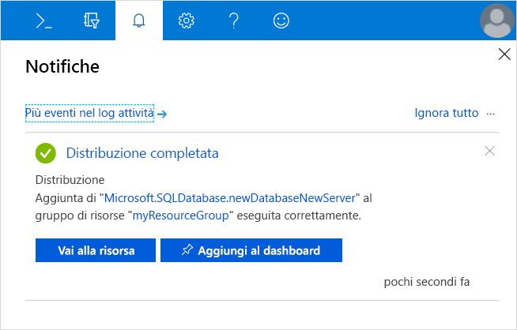
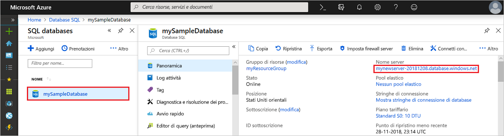
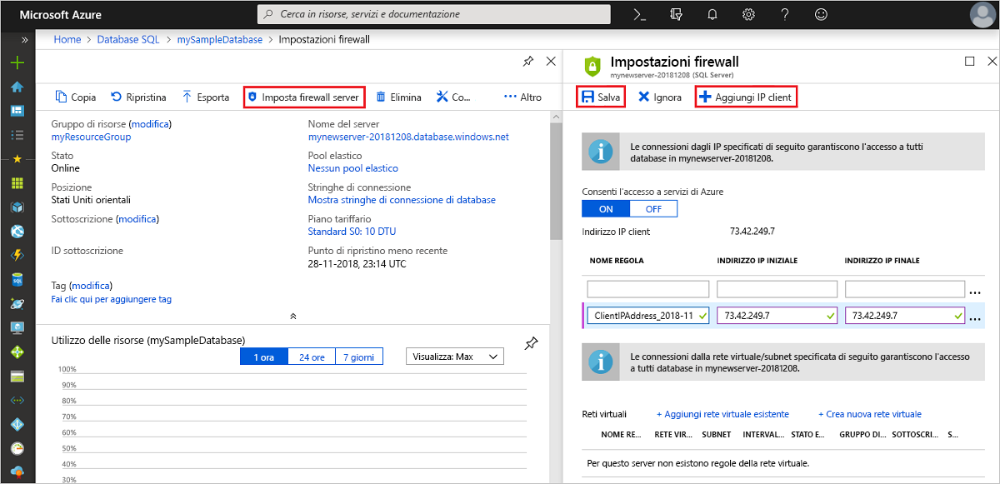

## Accedere al Portale di Azure.

Accedere al [Portale di Azure](https://portal.azure.com/).

## Creare un database SQL vuoto

Un database SQL di Azure viene creato con un set definito di [risorse di calcolo e di archiviazione](../articles/sql-database/sql-database-service-tiers.md). Il database viene creato in un [gruppo di risorse di Azure](../articles/azure-resource-manager/resource-group-overview.md) e in un [server logico di database SQL di Azure](../articles/sql-database/sql-database-features.md). 

Per creare un database SQL vuoto, attenersi alla procedura seguente. 

1. Fare clic sul pulsante **Nuovo** nell'angolo superiore sinistro del portale di Azure.

2. Selezionare **Database** dalla pagina **Nuovo**, quindi selezionare **Crea** in **Database SQL** nella pagina **Nuovo**.

   

3. Compilare il modulo Database SQL con le informazioni seguenti, come illustrato nell'immagine precedente:   

   | Impostazione       | Valore consigliato | Descrizione | 
   | ------------ | ------------------ | ------------------------------------------------- | 
   | **Database name** (Nome database) | mySampleDatabase | Per i nomi di database validi, vedere [Database Identifiers](https://docs.microsoft.com/sql/relational-databases/databases/database-identifiers) (Identificatori di database). | 
   | **Sottoscrizione** | Sottoscrizione in uso  | Per informazioni dettagliate sulle sottoscrizioni, vedere [Subscriptions](https://account.windowsazure.com/Subscriptions) (Sottoscrizioni). |
   | **Gruppo di risorse** | myResourceGroup | Per i nomi di gruppi di risorse validi, vedere [Naming rules and restrictions](https://docs.microsoft.com/azure/architecture/best-practices/naming-conventions) (Regole di denominazione e restrizioni). |
   | **Select source** (Seleziona origine) | Database vuoto | Indica che deve essere creato un database vuoto. |

4. Fare clic su **Server** per creare e configurare un nuovo server per il nuovo database. Compilare il **modulo del nuovo server** con le informazioni seguenti: 

   | Impostazione       | Valore consigliato | Descrizione | 
   | ------------ | ------------------ | ------------------------------------------------- | 
   | **Server name** (Nome server) | Qualsiasi nome globalmente univoco | Per i nomi di server validi, vedere [Naming rules and restrictions](https://docs.microsoft.com/azure/architecture/best-practices/naming-conventions) (Regole di denominazione e restrizioni). | 
   | **Nome di accesso amministratore server** | Qualsiasi nome valido | Per i nomi di accesso validi, vedere [Database Identifiers](https://docs.microsoft.com/sql/relational-databases/databases/database-identifiers) (Identificatori di database).|
   | **Password** | Qualsiasi password valida | La password deve almeno 8 caratteri e contenere caratteri inclusi in tre delle categorie seguenti: caratteri maiuscoli, caratteri minuscoli, numeri e caratteri non alfanumerici. |
   | **Posizione** | Qualsiasi località valida | Per informazioni sulle aree, vedere [Aree di Azure](https://azure.microsoft.com/regions/). |

   

5. Fare clic su **Seleziona**.

6. Fare clic su **Piano tariffario** per specificare il livello di servizio, il numero di DTU e la quantità di risorse di archiviazione. Esplorare le opzioni relative alla quantità di DTU e di risorse di archiviazione disponibile per ogni livello di servizio. 

7. Per questa esercitazione selezionare il livello di servizio **Standard** e quindi usare il dispositivo di scorrimento per selezionare **100 DTU (S3)** e **400** GB di archiviazione.

   

8. Accettare le condizioni dell'anteprima per usare l'opzione **Spazio di archiviazione aggiuntivo**. 

   > [!IMPORTANT]
   > \* Le dimensioni di archiviazione superiori alla quantità di risorse di archiviazione incluse sono disponibili in anteprima e vengono applicati costi aggiuntivi. Per ulteriori informazioni, vedere [Database SQL Prezzi](https://azure.microsoft.com/pricing/details/sql-database/). 
   >
   >\* Nel livello Premium sono attualmente disponibili più di 1 TB di risorse di archiviazione nelle aree seguenti: Stati Uniti orientali 2, Stati Uniti occidentali, US Gov Virginia, Europa occidentale, Germania centrale, Asia sud-orientale, Giappone orientale, Australia orientale, Canada centrale e Canada orientale. Vedere [Limitazioni correnti per P11-P15](../articles/sql-database/sql-database-resource-limits.md#single-database-limitations-of-p11-and-p15-when-the-maximum-size-greater-than-1-tb).  
   > 

9. Dopo la selezione del livello di servizio, del numero di DTU e della quantità di risorse di archiviazione, fare clic su **Applica**.  

10. Selezionare **regole di confronto** per il database vuoto. Per questa esercitazione usare il valore predefinito. Per altre informazioni sulle regole di confronto, vedere [Collations](https://docs.microsoft.com/sql/t-sql/statements/collations) (Regole di confronto)

11. Fare clic su **Crea** per effettuare il provisioning del database. Il provisioning richiede circa un minuto e mezzo per il completamento. 

12. Sulla barra degli strumenti fare clic su **Notifiche** per monitorare il processo di distribuzione.
    
     

## Creare una regola del firewall a livello di server

Il servizio di database SQL crea un firewall a livello di server che impedisce alle applicazioni e agli strumenti esterni di connettersi al server o ai database sul server a meno che non venga creata una regola del firewall per aprire il firewall per indirizzi IP specifici. Seguire questi passaggi per creare una [regola del firewall a livello di server di database SQL](../articles/sql-database/sql-database-firewall-configure.md) per l'indirizzo IP del client e abilitare la connettività esterna tramite il firewall del database SQL solo per il proprio indirizzo IP. 

> [!NOTE]
> Il database SQL comunica attraverso la porta 1433. Se si sta tentando di connettersi da una rete aziendale, il traffico in uscita attraverso la porta 1433 potrebbe non essere autorizzato dal firewall della rete. In questo caso, non è possibile connettersi al server del database SQL di Azure, a meno che il reparto IT non apra la porta 1433.
>

1. Al termine della distribuzione, scegliere **Database SQL** dal menu a sinistra e fare clic su **mySampleDatabase** nella pagina **Database SQL**. Si apre la pagina di panoramica per il database che visualizza il nome completo del server, ad esempio **mynewserver20170824.database.windows.net**, e offre altre opzioni di configurazione. 

2. Copiare il nome completo del server per connettersi al server e ai relativi database nelle guide introduttive successive. 

    

3. Fare clic su **Imposta firewall server** sulla barra degli strumenti. Si apre la pagina **Impostazioni del firewall** per il server del database SQL. 

    

4. Fare clic su **Aggiungi IP client** sulla barra degli strumenti per aggiungere l'indirizzo IP corrente a una nuova regola del firewall. Una regola del firewall può aprire la porta 1433 per un indirizzo IP singolo o un intervallo di indirizzi IP.

5. Fare clic su **Salva**. Viene creata una regola del firewall a livello di server per l'indirizzo IP corrente, che apre la porta 1433 nel server logico.

6. Fare clic su **OK** e quindi chiudere la pagina **Impostazioni del firewall**.

È ora possibile connettersi al server del database SQL e ai relativi database usando SQL Server Management Studio o un altro strumento di propria scelta da questo indirizzo IP, con l'account amministratore del server creato in precedenza.

> [!IMPORTANT]
> Per impostazione predefinita, l'accesso attraverso il firewall del database SQL è abilitato per tutti i servizi di Azure. Selezionando **NO** in questa pagina permette di disabilitare tutti i servizi di Azure.

## Informazioni di connessione SQL Server

Ottenere il nome completo del server per il server del database SQL di Azure nel portale di Azure. Usare il nome completo del server per connettersi al server tramite SQL Server Management Studio.

1. Accedere al [Portale di Azure](https://portal.azure.com/).
2. Scegliere **Database SQL** dal menu a sinistra, quindi fare clic sul database nella pagina **Database SQL**. 
3. Nel riquadro **Informazioni di base** della pagina del portale di Azure per il database individuare e quindi copiare il **Nome server**.

   
