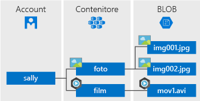

## Che cos'è l'archiviazione Blob?
Archivio BLOB di Azure è un servizio per l'archiviazione di grandi quantità di dati oggetto non strutturati, ad esempio dati di testo o binari, a cui è possibile accedere da qualsiasi parte del mondo tramite HTTP o HTTPS. L'archiviazione BLOB può essere usata per esporre dati pubblicamente a livello mondiale o archiviare privatamente i dati delle applicazioni.

Quelli di seguito sono gli impieghi più comuni dell'archiviazione BLOB:

* Richieste di documenti direttamente da un browser o immagini.
* Archiviazione di file per l'accesso distribuita.
* Flusso audio e video.
* L'archiviazione dei dati di backup e ripristino, il ripristino di emergenza e archiviazione.
* L'archiviazione dei dati per l'analisi da un locale o servizio ospitato in Azure.

## Concetti del servizio BLOB
Il servizio BLOB è composto dai componenti seguenti:

* **Account di archiviazione:** tutti gli accessi ad Archiviazione di Azure vengono eseguiti tramite un account di archiviazione. Questo account di archiviazione può essere un **account di archiviazione generico** o **account di archiviazione Blob**, che viene specializzato per l'archiviazione di oggetti o BLOB. Per altre informazioni, vedere [Informazioni sugli account di archiviazione di Azure](../articles/storage/common/storage-create-storage-account.md).
* **Contenitore:** un contenitore è un raggruppamento di un set di BLOB. Tutti i BLOB devono trovarsi in un contenitore. In un account può esistere un numero illimitato di contenitori. In un contenitore può essere archiviato un numero illimitato di BLOB. Il nome del contenitore deve essere in lettere minuscole.
* **BLOB:** file di qualsiasi tipo e dimensione. Archiviazione di Azure offre tre tipi di BLOB: BLOB in blocchi, BLOB di aggiunta e BLOB di pagine.
  
    *BLOB in blocchi* sono ideali per l'archiviazione di file di testo o file binari, ad esempio i documenti e i file multimediali. Un singolo BLOB in blocchi può contenere fino a 50.000 blocchi da al massimo 100 MB ognuno, per una dimensione totale leggermente superiore a 4,75 TB (100 MB X 50.000). 

    *BLOB di accodamento* sono simili ai BLOB in blocchi in quanto sono costituiti da blocchi, ma sono ottimizzati per le operazioni di accodamento, in modo che siano utili per gli scenari di registrazione. Un singolo BLOB di accodamento può contenere fino a 50.000 blocchi da al massimo 4 MB ognuno, per una dimensione totale leggermente superiore a 195 GB (4 MB X 50.000).
  
    *BLOB di pagine* possono avere un dimensione di al massimo 1 TB e sono più efficienti per operazioni di lettura/scrittura frequenti. Macchine virtuali di Azure usare BLOB di pagine come sistema operativo e i dischi dati.
  
    Per ulteriori informazioni sulla denominazione dei contenitori e BLOB, vedere [denominazione e riferimento a contenitori, BLOB e metadati](/rest/api/storageservices/Naming-and-Referencing-Containers--Blobs--and-Metadata).

