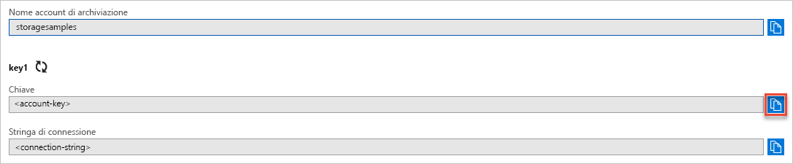

## Copiare le credenziali dal portale di Azure

L'applicazione di esempio deve autorizzare l'accesso all'account di archiviazione. Fornire all'applicazione le credenziali dell'account di archiviazione sotto forma di stringa di connessione. Per visualizzare le credenziali dell'account di archiviazione:

1. Accedere al [portale di Azure](https://portal.azure.com).
2. Individuare l'account di archiviazione.
3. Nella sezione **Impostazioni** della panoramica dell'account di archiviazione selezionare **Chiavi di accesso**. Vengono visualizzate le chiavi di accesso dell'account e una stringa di connessione.
4. Prendere nota del nome dell'account di archiviazione, che sarà necessario per l'autorizzazione.   
5. Trovare il valore **Chiave** in **key1** e selezionare **Copia** per copiare la chiave dell'account.

    
