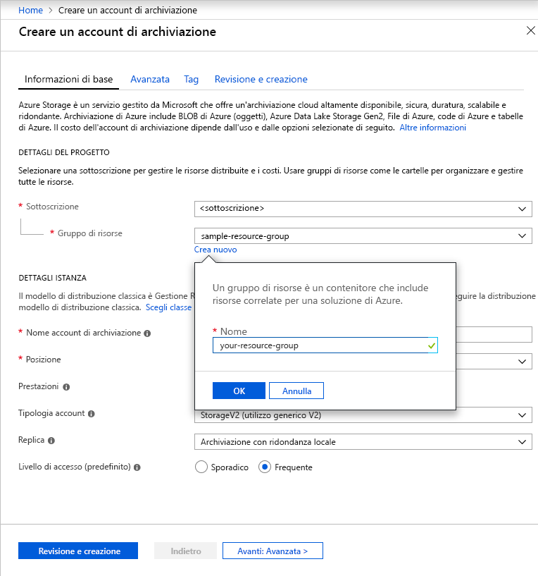

Per creare un account di archiviazione per utilizzo generico v2 nel portale di Azure, eseguire questa procedura:

1. Nel portale di Azure fare clic su **Tutti i servizi**. Nell'elenco delle risorse digitare **Account di archiviazione**. Non appena si inizia a digitare, l'elenco viene filtrato in base all'input. Selezionare **Account di archiviazione**.
1. Nella finestra **Account di archiviazione** visualizzata scegliere **Aggiungi**.
1. Selezionare la sottoscrizione in cui creare l'account di archiviazione.
1. Nel campo **Gruppo di risorse** selezionare **Crea nuovo**. Immettere un nome per il nuovo gruppo di risorse, come illustrato nell'immagine seguente.

    

1. Immettere quindi un nome per l'account di archiviazione. Il nome scelto deve essere univoco in Azure. Deve avere inoltre una lunghezza compresa tra 3 e 24 caratteri e può contenere solo numeri e lettere minuscole.
1. Selezionare la località per l'account di archiviazione o usare la località predefinita.
1. Mantenere i valori predefiniti per questi campi:

   |Campo  |Valore  |
   |---------|---------|
   |Modello di distribuzione     |Gestione risorse         |
   |Prestazioni     |Standard         |
   |Tipo di account     |Archiviazione v2 (utilizzo generico V2)         |
   |Replica     |Archiviazione con ridondanza locale (LRS)         |
   |Livello di accesso     |Accesso frequente         |

1. Selezionare **Rivedi e crea** per esaminare le impostazioni dell'account di archiviazione e creare l'account.
1. Selezionare **Create**.

Per altre informazioni sui tipi di account di archiviazione e su altre impostazioni dell'account di archiviazione, vedere [Panoramica dell'account di archiviazione di Azure](https://docs.microsoft.com/azure/storage/common/storage-account-overview). Per altre informazioni sui gruppi di risorse, vedere [Panoramica di Azure Resource Manager](https://docs.microsoft.com/azure/azure-resource-manager/resource-group-overview). 
