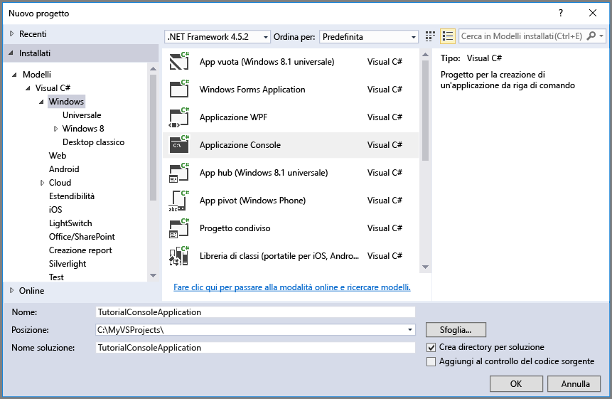

## <a name="set-up-your-development-environment"></a>Configurazione dell'ambiente di sviluppo
Configurare quindi l'ambiente di sviluppo in Visual Studio per poter provare gli esempi di codice di questa guida.

### <a name="create-a-windows-console-application-project"></a>Creare un progetto di applicazione console di Windows
In Visual Studio creare una nuova applicazione console di Windows. La procedura seguente illustra come creare un'applicazione console in Visual Studio 2017, ma i passaggi sono simili anche per le altre versioni di Visual Studio.

1. Selezionare **File** > **Nuovo** > **Progetto**
2. Selezionare **Installati** > **Modelli** > **Visual C#** > **Desktop classico di Windows**
3. Selezionare **App console (.NET Framework)**
4. Immettere un nome per l'applicazione nel campo **Nome**
5. Selezionare **OK**.



Tutti gli esempi di codice in questa esercitazione possono essere aggiunti al metodo `Main()` del file `Program.cs` dell'applicazione console.

È possibile usare la libreria client di archiviazione di Azure in qualsiasi tipo di applicazione .NET, ad esempio un servizio cloud o un'app Web di Azure e applicazioni desktop e per dispositivi mobili. Per semplicità, in questa guida si usa un'applicazione console.

### <a name="use-nuget-to-install-the-required-packages"></a>Usare NuGet per installare i pacchetti necessari
Per completare questa esercitazione, è necessario fare riferimento a due pacchetti nel progetto:

* [Libreria client di archiviazione di Microsoft Azure per .NET](https://www.nuget.org/packages/WindowsAzure.Storage/): questo pacchetto fornisce l'accesso a livello di codice alle risorse dati nell'account di archiviazione.
* [Libreria Gestione configurazione di Microsoft Azure per .NET](https://www.nuget.org/packages/Microsoft.WindowsAzure.ConfigurationManager/): questo pacchetto fornisce una classe per l'analisi di una stringa di connessione in un file di configurazione, indipendentemente dalla posizione in cui viene eseguita l'applicazione.

Per ottenere entrambi i pacchetti, è possibile usare NuGet. A tale scopo, seguire questa procedura:

1. Fare clic con il pulsante destro del mouse sul progetto in **Esplora soluzioni** e scegliere **Gestisci pacchetti NuGet**.
2. Cercare online "WindowsAzure.Storage" e fare clic su **Installa** per installare il pacchetto della libreria client di archiviazione e le relative dipendenze.
3. Cercare online "WindowsAzure.ConfigurationManager" e fare clic su **Installa** per installare Gestione configurazione di Azure.

> [!NOTE]
> Il pacchetto della libreria client di archiviazione è incluso anche in [Azure SDK per .NET](https://azure.microsoft.com/downloads/). È tuttavia consigliabile installare anche la libreria client di archiviazione da NuGet per assicurarsi di avere sempre la versione più recente di questa libreria.
> 
> Le dipendenze ODataLib nella libreria client di archiviazione per .NET vengono risolte dai pacchetti ODataLib disponibili in NuGet, non da WCF Data Services. È possibile scaricare le librerie ODataLib direttamente oppure farvi riferimento nel progetto del codice tramite NuGet. I pacchetti ODataLib specifici usati dalla libreria client di archiviazione sono [OData](http://nuget.org/packages/Microsoft.Data.OData/), [Edm](http://nuget.org/packages/Microsoft.Data.Edm/) e [Spatial](http://nuget.org/packages/System.Spatial/). Sebbene queste librerie vengono utilizzate dalle classi di archiviazione tabelle di Azure, sono dipendenze necessarie per la programmazione con la libreria client di archiviazione.
> 
> 

### <a name="determine-your-target-environment"></a>Determinare l'ambiente di destinazione
Sono disponibili due opzioni relative all'ambiente per l'esecuzione degli esempi di questa guida:

* È possibile eseguire il codice con un account di archiviazione di Azure nel cloud. 
* È possibile eseguire il codice nell'emulatore di archiviazione di Azure. L'emulatore di archiviazione è un ambiente locale che emula un account di archiviazione di Azure nel cloud. L'emulatore è un'opzione gratuita per il test e il debug del codice durante lo sviluppo dell'applicazione. L'emulatore usa un account e una chiave noti. Per altre informazioni, vedere [Usare l'emulatore di archiviazione di Azure per sviluppo e test](../articles/storage/common/storage-use-emulator.md)

Se si specifica come destinazione un account di archiviazione nel cloud, immettere la chiave di accesso primaria per tale account tramite il portale di Azure. Per altre informazioni, vedere [Gestire le chiavi di accesso alle risorse di archiviazione](../articles/storage/common/storage-create-storage-account.md#view-and-copy-storage-access-keys).

> [!NOTE]
> È possibile impostare come destinazione l'emulatore di archiviazione per evitare di incorrere negli eventuali costi associati al servizio Archiviazione di Azure. Se però si sceglie di impostare come destinazione un account di archiviazione di Azure nel cloud, i costi per eseguire questa esercitazione saranno minimi.
> 
> 

### <a name="configure-your-storage-connection-string"></a>Configurare la stringa di connessione di archiviazione
Nella libreria del client di archiviazione di Azure per .NET è possibile usare una stringa di connessione di archiviazione per configurare gli endpoint e le credenziali per l'accesso ai servizi di archiviazione. Per gestire nel modo migliore la stringa di connessione di archiviazione, usare un file di configurazione. 

Per altre informazioni sulle stringhe di connessione, vedere [Configurare le stringhe di connessione di archiviazione di Azure](../articles/storage/common/storage-configure-connection-string.md).

> [!NOTE]
> La chiave dell’account di archiviazione è simile alla password radice per l'account di archiviazione. È consigliabile proteggere sempre la chiave dell'account di archiviazione. Evitare di distribuirla ad altri utenti, impostarla come hardcoded o salvarla in un file di testo normale accessibile ad altri. Rigenerare la chiave tramite il portale di Azure se si ritiene che possa essere stata compromessa.
> 
> 

Per configurare la stringa di connessione, aprire il file `app.config` da Esplora soluzioni in Visual Studio. Aggiungere il contenuto dell'elemento `<appSettings>` illustrato di seguito. Sostituire `account-name` con il nome dell'account di archiviazione e `account-key` con la chiave di accesso dell'account:

```xml
<configuration>
    <startup> 
        <supportedRuntime version="v4.0" sku=".NETFramework,Version=v4.5.2" />
    </startup>
    <appSettings>
        <add key="StorageConnectionString" value="DefaultEndpointsProtocol=https;AccountName=account-name;AccountKey=account-key" />
    </appSettings>
</configuration>
```

Ad esempio, l'impostazione di configurazione si presenta simile a:

```xml
<add key="StorageConnectionString" value="DefaultEndpointsProtocol=https;AccountName=storagesample;AccountKey=GMuzNHjlB3S9itqZJHHCnRkrokLkcSyW7yK9BRbGp0ENePunLPwBgpxV1Z/pVo9zpem/2xSHXkMqTHHLcx8XRA==" />
```

Per impostare come destinazione l'emulatore di archiviazione, è possibile usare un collegamento con mapping al nome dell'account e alla chiave noti. In questo caso, l'impostazione della stringa di connessione è:

```xml
<add key="StorageConnectionString" value="UseDevelopmentStorage=true;" />
```

