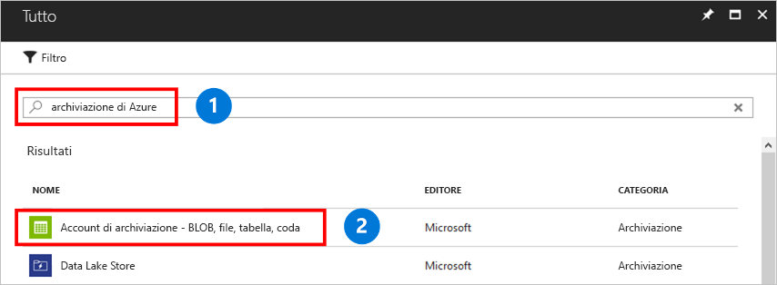

Un account di archiviazione è un pool condiviso di spazio di archiviazione in cui è possibile distribuire una condivisione file di Azure o altre risorse di archiviazione, ad esempio BLOB o code. Un account di archiviazione può contenere un numero illimitato di condivisioni e una condivisione può archiviare un numero illimitato di file, fino ai limiti di capacità dell'account di archiviazione.

Per creare un account di archiviazione:

1. Nel menu a sinistra fare clic su **+** per creare una risorsa.
2. Digitare **account di archiviazione** nella casella di ricerca (1) e selezionare **Account di archiviazione: BLOB, File, Tabelle, Code** (2) e quindi fare clic su **Crea**.
    

3. In **Nome** digitare *mystorageacct* seguito da alcuni numeri casuali fino a visualizzare il segno di spunta verde indicante che si tratta di un nome univoco. Un nome di account di archiviazione deve contenere solo caratteri minuscoli ed essere univoco globalmente. Prendere nota del nome dell'account di archiviazione perché lo si userà in un secondo momento. 
4. In **Modello di distribuzione** lasciare il valore predefinito **Resource Manager**. Per altre informazioni sulle differenze tra Azure Resource Manager e la distribuzione classica, vedere [Informazioni sui modelli di distribuzione e sullo stato delle risorse](../articles/azure-resource-manager/resource-manager-deployment-model.md).
5. In **Tipologia account** selezionare **Archiviazione v2**. Per altre informazioni sulle diverse tipologie di account di archiviazione, vedere [Informazioni sugli account di archiviazione di Azure](../articles/storage/common/storage-account-options.md?toc=%2fazure%2fstorage%2ffiles%2ftoc.json).
6. In **Prestazioni** mantenere il valore predefinito **Archiviazione Standard**. File di Azure attualmente supporta solo l'archiviazione Standard. Anche se si seleziona l'archiviazione Premium, la condivisione file viene salvata nell'archiviazione Standard.
7. In **Replica** selezionare *Archiviazione con ridondanza locale*. 
8. In **Trasferimento sicuro obbligatorio** è consigliabile selezionare sempre **Abilitato**. Per altre informazioni su questa opzione, vedere [Informazioni sulla crittografia dei dati in transito](../articles/storage/common/storage-require-secure-transfer.md?toc=%2fazure%2fstorage%2ffiles%2ftoc.json).
9. In **Sottoscrizione** selezionare la sottoscrizione in cui creare l'account di archiviazione. Se è presente solo una sottoscrizione, sarà quella predefinita.
10. In **Gruppo di risorse** selezionare **Crea nuovo** e digitare *myResourceGroup* come nome.
11. In **Località** selezionare **Stati Uniti Orientali**.
12. In **Reti virtuali** lasciare l'opzione predefinita *disabilitata*. 
13. Selezionare **Aggiungi al dashboard** per poter trovare più facilmente l'account di archiviazione.
14. Al termine, fare clic su **Crea** per avviare la distribuzione.