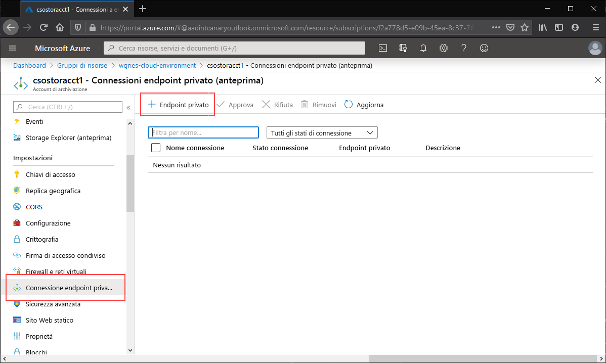
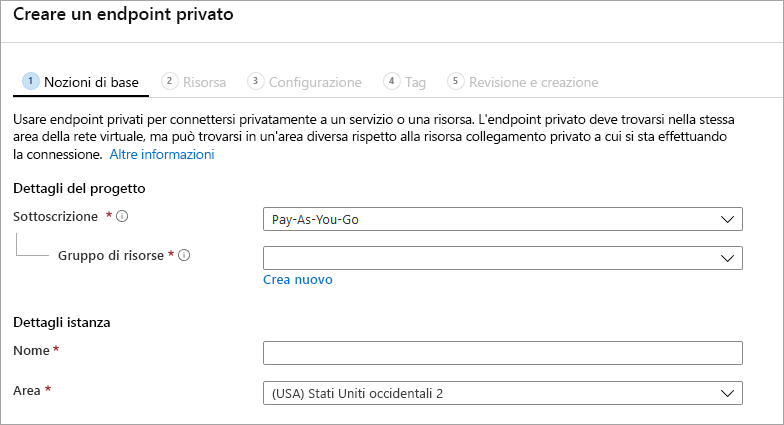
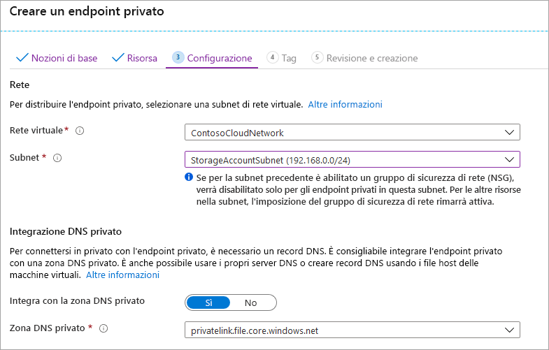

Passare all'account di archiviazione per cui creare un endpoint privato. Nel sommario dell'account di archiviazione selezionare **Connessioni endpoint privato** e quindi **+ Endpoint privato** per creare un nuovo endpoint privato. 

La procedura guidata risultante include più pagine da completare.

Nel pannello **Informazioni di base** selezionare il gruppo di risorse, il nome e l'area da usare per l'endpoint privato, che non devono necessariamente corrispondere a quelli dell'account di archiviazione, anche se l'endpoint privato deve essere creato nella stessa area della rete virtuale in cui inserirlo.

Nel pannello **Risorsa** selezionare il pulsante di opzione **Connettersi a una risorsa di Azure nella directory**. In **Tipo di risorsa** selezionare **Microsoft.Storage/storageAccounts**. Il campo **Risorsa** corrisponde all'account di archiviazione con la condivisione file di Azure a cui connettersi. La sottorisorsa di destinazione è **file**, perché la procedura riguarda File di Azure.

Il pannello **Configurazione** consente di selezionare la rete virtuale e la subnet specifiche a cui aggiungere l'endpoint privato. È necessario selezionare una subnet distinta da quella aggiunta all'endpoint di servizio in precedenza. Il pannello Configurazione contiene anche le informazioni per la creazione o l'aggiornamento della zona DNS privato. È consigliabile usare la zona `privatelink.file.core.windows.net` predefinita.

Fare clic su **Rivedi e crea** per creare l'endpoint privato. 