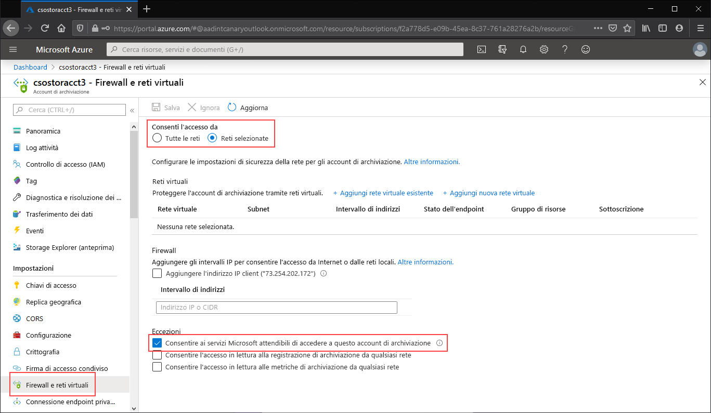

Passare all'account di archiviazione per cui limitare tutto l'accesso all'endpoint pubblico. Nel sommario dell'account di archiviazione selezionare **Firewall e reti virtuali**.

Nella parte superiore della pagina selezionare il pulsante di opzione **Reti selezionate**. Verranno rese visibili diverse impostazioni nascoste per il controllo della restrizione dell'endpoint pubblico. Selezionare **Consenti ai servizi Microsoft attendibili di accedere a questo account di archiviazione** per consentire ai servizi Microsoft attendibili, ad esempio Sincronizzazione file di Azure, di accedere all'account di archiviazione.

