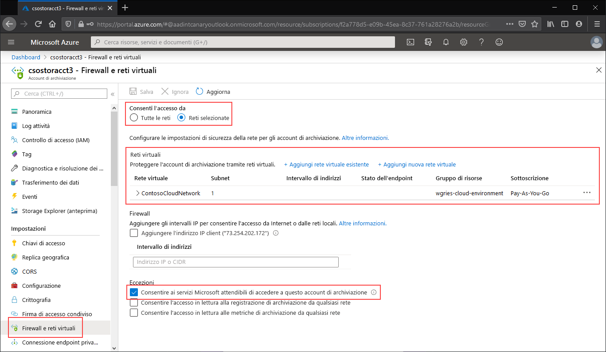

Passare all'account di archiviazione per cui limitare tutto l'accesso all'endpoint pubblico consentendolo solo a specifiche reti virtuali. Nel sommario dell'account di archiviazione selezionare **Firewall e reti virtuali**. 

Nella parte superiore della pagina selezionare il pulsante di opzione **Reti selezionate**. Verranno rese visibili diverse impostazioni nascoste per il controllo della restrizione dell'endpoint pubblico. Fare clic su **+ Aggiungi rete virtuale esistente** per selezionare la rete virtuale specifica a cui deve essere consentito l'accesso all'account di archiviazione tramite l'endpoint pubblico. Sarà necessario selezionare una rete virtuale e una subnet associata. 

Selezionare **Consenti ai servizi Microsoft attendibili di accedere a questo account di archiviazione** per consentire ai servizi Microsoft attendibili, ad esempio Sincronizzazione file di Azure, di accedere all'account di archiviazione.

