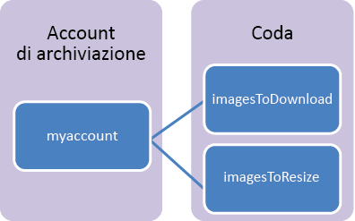

## Informazioni sull'archiviazione di accodamento

Il servizio di archiviazione di accodamento di Azure consente di archiviare grandi quantità di messaggi ai quali è possibile accedere da qualsiasi parte del mondo mediante chiamate autenticate tramite HTTP o HTTPS. La dimensione massima di un singolo messaggio della coda è di 64 KB e una coda può contenere milioni di messaggi, nei limiti della capacità complessiva di un account di archiviazione.

Di seguito sono riportati gli utilizzi più comuni per il servizio di archiviazione di accodamento.

-   Creazione di un backlog di lavoro da elaborare in modo asincrono
-   Passaggio di messaggi da un ruolo Web di Azure a un ruolo di lavoro di Azure

## Concetti del servizio di accodamento

Il servizio di accodamento contiene i componenti seguenti:

- **Formato dell'URL:** è possibile fare riferimento alle code usando il formato di URL seguente: http://`<storage account>`.queue.core.windows.net/`<queue>` 
      
	L'URL seguente fa riferimento a una delle code nel diagramma:
		
		http://myaccount.queue.core.windows.net/imagesToDownload

- **Account di archiviazione:** l'accesso ad Archiviazione di Azure viene eseguito esclusivamente tramite un account di archiviazione. Per informazioni sulla capacità dell'account di archiviazione, vedere [Obiettivi di scalabilità e prestazioni per Archiviazione di Azure](../articles/storage/storage-scalability-targets.md).

- **Coda:** una coda contiene un set di messaggi. Tutti i messaggi devono essere inclusi in una coda.

- **Messaggio:** un messaggio, in qualsiasi formato, con dimensioni massime di 64 KB. Il tempo massimo che un messaggio può rimanere nella coda è di 7 giorni.

<!---HONumber=AcomDC_0406_2016-->