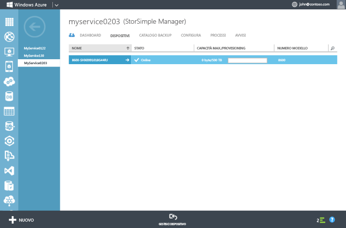

<!--author=alkohli last changed: 9/17/15-->

### Per configurare e registrare il dispositivo

1. Accedere all'interfaccia di Windows PowerShell sulla console seriale del dispositivo StorSimple. Per istruzioni, vedere [Utilizzare PuTTY per connettersi alla console seriale del dispositivo](#use-putty-to-connect-to-the-device-serial-console). **Assicurarsi di seguire la procedura esattamente o non si sarà in grado di accedere alla console.**

2. Nella sessione che viene aperta, premere INVIO una volta per visualizzare un prompt dei comandi.

3. Verrà richiesto di scegliere la lingua che si desidera impostare per il dispositivo. Specificare la lingua, quindi premere INVIO.

    

4. Nel menu della console seriale che viene visualizzato, scegliere l'opzione 1 per eseguire l’accesso completo.

    
  
     Completare i passaggi da 5 a 12 per configurare le impostazioni di rete minime richieste per il dispositivo. **È necessario eseguire questa procedura sul controller attivo del dispositivo.** Nel messaggio dell’intestazione del menu della console seriale è indicato lo stato del controller. Se non si è connessi al controller attivo, disconnettersi e quindi connettersi al controller attivo.

5. Al prompt dei comandi, digitare la password. La password predefinita è **Password1**.

6. Digitare il seguente comando: `Invoke-HcsSetupWizard`.

7. Verrà visualizzata una procedura guidata per configurare le impostazioni di rete per il dispositivo. Fornire le informazioni seguenti:
   - Indirizzo IP per l'interfaccia di rete DATA 0
   - Subnet mask
   - Gateway
   - Indirizzo IP per il server DNS primario
    
		Si noti che il sistema convalida le impostazioni di rete dopo ogni passaggio del processo.
   
      >[AZURE.NOTE]Potrebbe essere necessario attendere alcuni minuti affinché la subnet mask e le impostazioni DNS vengano applicate. Se viene visualizzato un messaggio di errore "Controllare la connettività di rete a Data 0", controllare la connessione di rete fisica nell’interfaccia di rete DATA 0 del controllore attivo.

8. (Facoltativo) configurare il server proxy Web. Sebbene la configurazione del proxy Web sia facoltativa, **tenere presente che se si utilizza un proxy Web, è possibile configurarlo solo qui**. Per ulteriori informazioni, andare a [Configurare il proxy Web per il dispositivo](../articles/storsimple/storsimple-configure-web-proxy.md).

9. Configurare un server NTP primario per il dispositivo. I server NTP sono obbligatori, in quanto il dispositivo deve sincronizzare l'ora in modo da poter eseguire l’autenticazione con i provider del servizio cloud. Assicurarsi che la rete consenta il traffico NTP dal data center a Internet. Se non è possibile, specificare un server NTP interno.
 
10. Per motivi di sicurezza la password di amministratore del dispositivo scade dopo la prima sessione e sarà necessario modificarla ora. Quando richiesto, fornire una password di amministratore del dispositivo. Una password di amministratore dispositivo valida deve avere una lunghezza compresa tra gli 8 e i 15 caratteri. La password deve contenere tre dei seguenti tipi di caratteri: minuscole, maiuscole, numeri e caratteri speciali.

	 

11. Il passaggio finale dell'installazione guidata registra il dispositivo con il servizio StorSimple Manager. A tale scopo, è necessario il codice di registrazione del servizio ottenuto nel passaggio 2. Dopo aver fornito il codice di registrazione, potrebbe essere necessario attendere 2-3 minuti prima che il dispositivo venga registrato.

      >[AZURE.NOTE]È possibile premere CTRL+C in qualsiasi momento per uscire dall'installazione guidata. Se sono state immesse tutte le impostazioni di rete (indirizzo IP per Data 0, Subnet mask e Gateway), le voci verranno conservate.

	

12. Dopo la registrazione del dispositivo, verrà visualizzato un codice di crittografia dei dati di servizio. Copiare questo codice e salvarlo in un luogo sicuro. **Il codice verrà richiesto con il codice di registrazione del servizio allo scopo di registrare altri dispositivi con il servizio StorSimple Manager.** Per ulteriori informazioni sul codice, consultare [Sicurezza di StorSimple](../articles/storsimple/storsimple-security.md).
	
	

      >[AZURE.NOTE]Per copiare il testo dalla finestra della console seriale, è sufficiente selezionarlo. È quindi possibile incollarlo negli Appunti o in qualsiasi editor di testo. NON usare CTRL+C per copiare la chiave DEK del servizio. Se si usa CTRL+C l'installazione guidata verrà chiusa. Di conseguenza, la password di amministratore del dispositivo non verrà modificata e verrà ripristinata la password predefinita del dispositivo.

13. Uscire dalla console seriale.

14. Tornare al portale di gestione e completare la seguente procedura:
  1. Fare doppio clic sul servizio StorSimple Manager per accedere alla pagina **Avvio rapido**.
  2. Fare clic su **Visualizza dispositivi connessi**.
  3. Nella pagina **Dispositivi**, verificare che il dispositivo sia connesso correttamente al servizio controllando lo stato. Lo stato del dispositivo deve essere **Online**.
   
    	 
  
	Se lo stato del dispositivo è **Offline**, attendere qualche minuto che il dispositivo torni in linea.
	      
	Se il dispositivo è ancora offline dopo alcuni minuti, è necessario assicurarsi che la rete firewall sia stata configurata come descritto nei [requisiti di rete per il dispositivo StorSimple](../articles/storsimple/storsimple-system-requirements.md).
	
	Se non si possiede un supporto HTTP 1.1, verificare che la porta 9354 sia aperta alle comunicazioni in uscita. Questa porta viene usata per la comunicazione tra il servizio StorSimple Manager e il dispositivo StorSimple.
     
       

<!---HONumber=Oct15_HO3-->