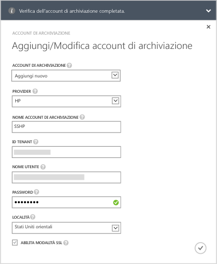

#### Per aggiungere un account di archiviazione nell’aggiornamento 1.0 della serie 8000 di StorSimple

1. Nella pagina di destinazione del servizio StorSimple Manager, selezionare il servizio e fare doppio clic su di esso. Verrà visualizzata la pagina **Avvio rapido**. Selezionare la pagina **Configura**.

2. Fare clic su **Aggiungi/modifica account di archiviazione**.

3. Nella finestra di dialogo **Aggiungi/modifica account di archiviazione** fare clic su **Aggiungi nuovo**.

4. Nel campo **Provider** selezionare il provider del servizio cloud appropriato. I provider supportati sono Azure, Amazon S3, Amazon S3 con RRS, HP e OpenStack. Specificare le credenziali e il percorso associati all'account di archiviazione dei provider del servizio cloud. I campi visualizzati per le credenziali saranno diversi a seconda del provider del servizio cloud specificato.
  - Se è stato selezionato Azure come provider del servizio cloud, fornire **Nome** e **Chiave di accesso** primaria per l'account di archiviazione di Microsoft Azure. Per un account di Azure, il percorso verrà inserito automaticamente.

        

 - Se è stato selezionato Amazon S3 o Amazon S3 con RRS, specificare un **nome account di archiviazione** descrittivo, una **chiave di accesso** e una **chiave segreta**. Per Amazon S3 e Amazon S3 con RRS, sono supportati i seguenti percorsi:

		- US Standard
		- US West (Oregon)
		- US West (Northern California)
		- EU (Ireland)
		- Asia Pacific (Singapore)
		- Asia Pacific (Sydney)
		- Asia Pacific (Tokyo)
		- South America (Sao Paulo)

        
	  		
 - Se è stato selezionato HP come provider del servizio cloud, fornire un **nome account di archiviazione** descrittivo, un **ID tenant**, un **nome utente** e una **password**. Per HP, sono supportati i percorsi seguenti:

		- US East
		- US West
	  
        
	  		
 - Se è stato selezionato **Openstack** come provider del servizio cloud, fornire un **nome host**, una **chiave di accesso** e una **chiave segreta**.

        > [AZURE.NOTE] For all the cloud service providers, excluding Azure, a friendly name is allowed. You can use different friendly names and create more than one storage account with the same set of credentials.

        

5. Selezionare **Abilita modalità SSL** per creare un canale sicuro per la comunicazione di rete tra il dispositivo e il cloud. Deselezionare la casella di controllo **Abilita modalità SSL** solo se si opera all'interno di un cloud privato.

      >[AZURE.NOTE]Se si usa HP come provider, SSL viene sempre abilitato.
  		
6. Fare clic sull’icona del segno di spunta . Quando la creazione dell’account di archiviazione sarà completata si riceverà una notifica.

7. L'account di archiviazione appena creato verrà visualizzato nella pagina **Configura** in **Account di archiviazione**. Fare clic su **Salva** per salvare il nuovo account di archiviazione. Fare clic su **OK** quando viene richiesto di confermare.

<!---HONumber=July15_HO2-->