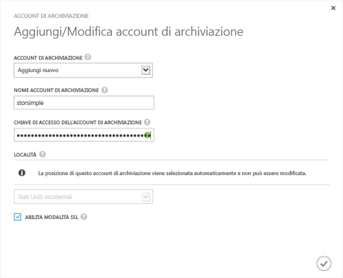

<!--author=SharS last changed: 9/17/15-->

#### Per aggiungere un nuovo account di archiviazione nella versione StorSimple Release (GA)

1. Nella pagina di destinazione del servizio StorSimple Manager, selezionare il servizio e fare doppio clic su di esso. Verrà visualizzata la pagina **Avvio rapido**. Selezionare la pagina **Configura**.

2. Fare clic su **Aggiungi/modifica account di archiviazione**.

3. Nella finestra di dialogo **Aggiungi/modifica account di archiviazione** effettuare le seguenti operazioni:

  1. Fare clic su **Aggiungi nuovo**.
  2. Fornire un nome per l'account di archiviazione.
  3. Fornire la **chiave di accesso** per l’account di archiviazione di Microsoft Azure.
  4. Selezionare **Abilita modalità SSL** per creare un canale sicuro per la comunicazione di rete tra il dispositivo e il cloud. Deselezionare la casella di controllo **Abilita modalità SSL** solo se si opera all'interno di un cloud privato.
  5. Fare clic sull’icona del segno di spunta . Quando la creazione dell’account di archiviazione sarà completata si riceverà una notifica.

    

4. L'account di archiviazione appena creato verrà visualizzato nella pagina **Configura** in **Account di archiviazione**. Fare clic su **Salva** per salvare l’account di archiviazione appena creato. Fare clic su **OK** quando viene richiesto di confermare.

<!---HONumber=Oct15_HO3-->