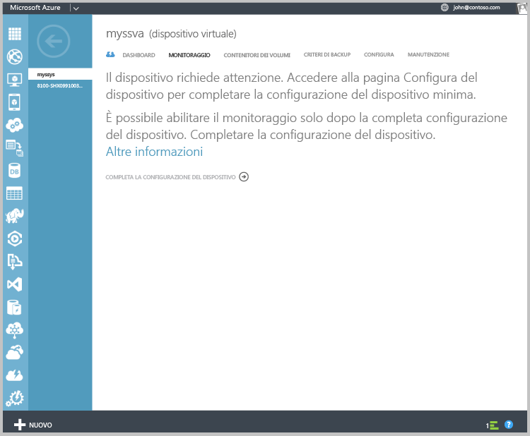
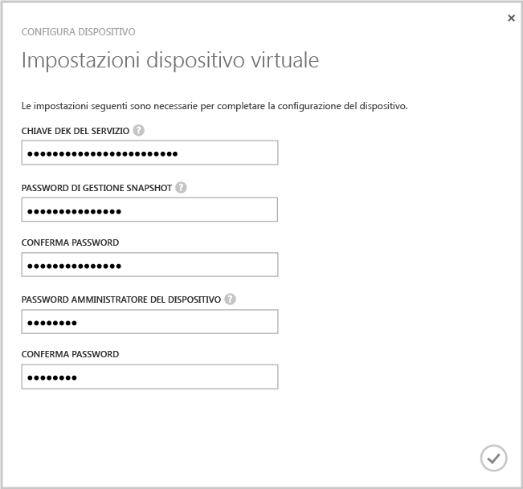
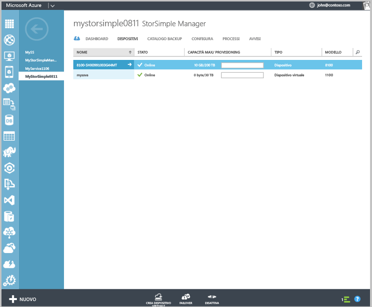

<!---author: alkohli, last updated: 11/05/2015 --->

Per configurare e registrare il dispositivo virtuale

1. Selezionare il dispositivo virtuale StorSimple appena creato nella pagina **Dispositivi** . 
2. Fare clic sull'opzione per **completare la configurazione del dispositivo**. Verrà avviata la configurazione guidata del dispositivo.
   
    
    
3. Immettere la **chiave DEK del servizio** nell'apposito spazio.
4. Immettere la password di Snapshot Manager e quella dell’amministratore del dispositivo che rispettino lunghezza e impostazioni specificate.
5. Fare clic sul segno di spunta per completare la configurazione e la registrazione iniziali del dispositivo virtuale. 
   
    

Dopo aver completato la configurazione e la registrazione, il dispositivo viene portato online. (Potrebbero occorrere alcuni minuti per questa operazione.)

<!--HONumber=Nov16_HO2-->

