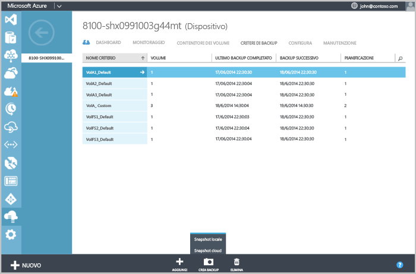
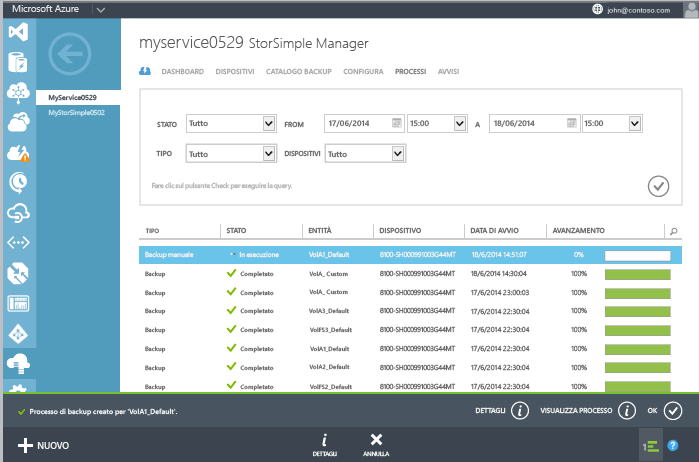

<properties 
	pageTitle="Creazione di un backup manuale" 
	description="Explique comment lancer un travail de sauvegarde manuel et à la demande." 
	services="storsimple" 
	documentationCenter="NA" 
	authors="SharS" 
	manager="adinah" 
	editor="tysonn" />

<tags 
   ms.service="storsimple"
   ms.devlang="NA"
   ms.topic="article"
   ms.tgt_pltfrm="NA"
   ms.workload="TBD"
   ms.date="04/01/2015"
   ms.author="v-sharos" />

### Per creare un backup manuale

1. Nella pagina **Dispositivi**, andare alla scheda **Criteri di backup**. In questa scheda vengono elencati tutti i criteri di backup in formato tabulare, tra cui il criterio per il volume di cui si desidera eseguire il backup.

2. Selezionare il criterio facendo clic in un punto qualsiasi nella riga corrispondente, eccetto per la prima colonna. Nella parte inferiore della pagina, fare clic su **Eseguire il backup**. Il pulsante verrà esteso per mostrare le opzioni di backup: snapshot locale e snapshot del cloud.

3. Quando si sceglie una di queste opzioni, verrà richiesto di confermare. Fare clic su **Sì**.

    
 
    Verrà avviato un processo di creazione di snapshot. Una volta completata la creazione del processo, verrà visualizzata una notifica nella parte inferiore della pagina.

4. Per monitorare il processo, fare clic su **Visualizza processo** nell'area di notifica \(nella parte inferiore della pagina\).

    

5. Una volta completato il processo di backup, andare alla scheda **Catalogo di backup**.

6. Impostare le selezioni filtro per il dispositivo appropriato, il criterio di backup e l’intervallo di tempo. Dopo aver impostato i filtri, fare clic sull’icona del segno di spunta .

  Il backup dovrebbe comparire nell'elenco dei set di backup che viene visualizzato nel catalogo.

<!--HONumber=52-->
