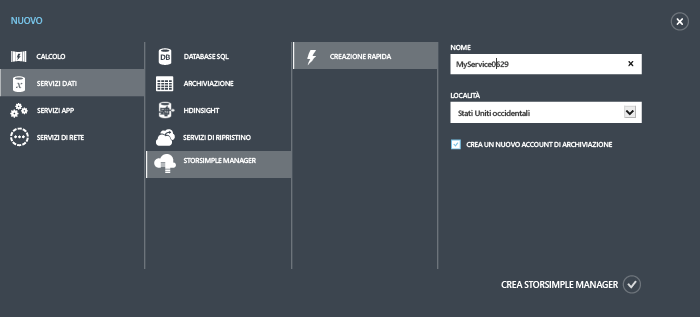
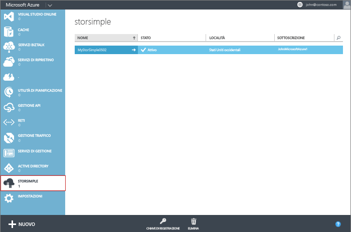

<!--author=alkohli last changed: 11/16/15-->

#### Per creare un nuovo servizio

1. Usare le credenziali dell'account Microsoft per accedere al portale di Azure all'URL seguente: [http://azure.microsoft.com/](http://azure.microsoft.com/).

2. Nel portale di Azure fare clic su **Nuovo** > **Servizi dati** > **StorSimple Manager** > **Creazione rapida**.

3. Nel modulo visualizzato, procedere come segue:
  1. Fornire un **Nome** univoco per il servizio. Si tratta di un nome descrittivo che può essere utilizzato per identificare il servizio. Il nome può contenere da 2 a 50 caratteri che possono essere lettere, numeri e trattini. Il nome deve iniziare e terminare con una lettera o un numero.
  2. Fornire una **Località** per il servizio. In generale, scegliere un percorso più vicino all'area geografica in cui si desidera distribuire il dispositivo. È inoltre possibile tenere in considerazione quanto segue: 
	 
		- If you have existing workloads in Azure that you also intend to deploy with your StorSimple device, you should use that datacenter.
		- Your StorSimple Manager service and Azure storage can be in two separate locations. In such a case, you are required to create the StorSimple Manager and Azure storage account separately. To create an Azure storage account, go to the Azure Storage service in the Azure portal and follow the steps in [Create an Azure Storage account](storage-create-storage-account.md#create-a-storage-account). After you create this account, add it to the StorSimple Manager service by following the steps in [Configure a new storage account for the service](storsimple-deployment-walkthrough.md#configure-a-new-storage-account-for-the-service).
		 
  3. Scegliere una **Sottoscrizione** dall'elenco a discesa. La sottoscrizione viene collegata all'account di fatturazione. Questo campo non è presente se si dispone di una sola sottoscrizione.
  4. Selezionare **Crea un nuovo account di archiviazione** per creare automaticamente un account di archiviazione con il servizio. Questo account di archiviazione avrà un nome speciale, ad esempio "storsimplebwv8c6dcnf". Se è necessario che i dati siano in un percorso diverso, deselezionare questa casella. 
  5. Fare clic su **Crea StorSimple Manager** per creare il servizio.

   

  Si verrà indirizzati alla pagina di destinazione del **Servizio**. La creazione del servizio richiederà alcuni minuti. Dopo che il servizio è stato creato, l'utente verrà informato in modo appropriato e lo stato del servizio verrà modificato in **Attivo**.
 
   

 **Video disponibile**

Per guardare un video che illustra come creare un nuovo servizio StorSimple Manager, fare clic [qui](http://azure.microsoft.com/documentation/videos/create-a-storsimple-manager-service/).

<!---HONumber=Nov15_HO4-->