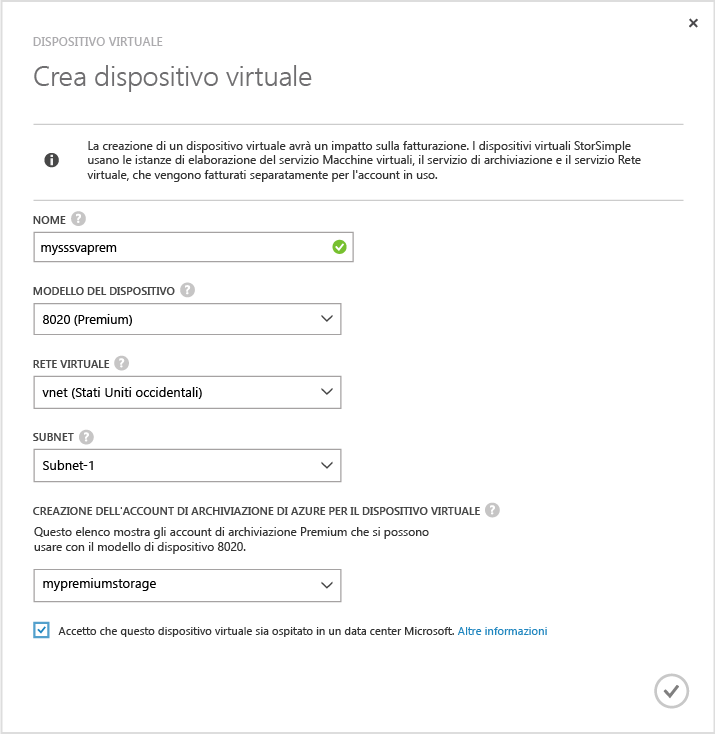
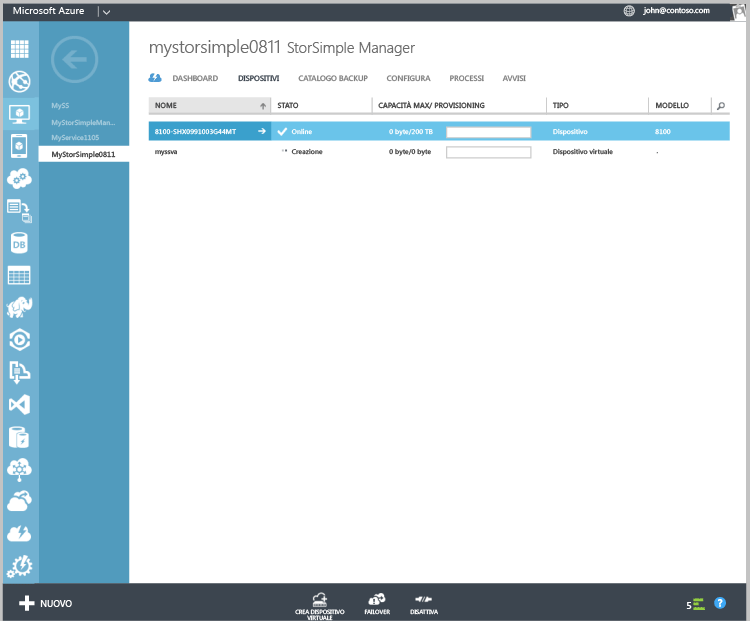

#### Per creare un dispositivo virtuale

1.  Nel portale di Azure, accedere al servizio **StorSimple Manager**.

2. Visitare la pagina **Dispositivi**. Fare clic su **Crea dispositivo virtuale** nella parte inferiore della pagina **Dispositivi**.

3. Nella **finestra di dialogo Crea dispositivo virtuale**, indicare quanto segue.

     

	1. **Nome**: un nome univoco per il dispositivo virtuale.

	2. **Modello**: scegliere il modello del dispositivo virtuale. Questo campo viene visualizzato solo se si esegue Update 2 o versione successiva. Un modello di dispositivo 8010 offre 30 TB di spazio di archiviazione Standard mentre 8020 dispone di 64 TB di spazio di archiviazione Premium. Specificare 8010
	3.  per distribuire gli scenari di recupero a livello di elemento dai backup. Selezionare 8020 per distribuire carichi di lavoro ad alte prestazioni e a bassa latenza o utilizzato come un dispositivo secondario per il ripristino di emergenza.
	 
	4. **Versione**: scegliere la versione del dispositivo virtuale. Se si seleziona un modello di dispositivo 8020, il campo della versione non sarà presentato all'utente. Questa opzione non è presente se tutti i dispositivi fisici registrati con questo servizio eseguono Update 1. Il campo viene visualizzato solo se con lo stesso servizio è registrata una combinazione di dispositivi fisici con versione Update 1 o precedente. Se si considera che la versione del dispositivo virtuale determina il dispositivo fisico da cui è possibile eseguire il failover o la clonazione, è importante creare una versione appropriata del dispositivo virtuale. Selezionare:

	   - Update 0.3 se si prevede di eseguire il failover o il ripristino di emergenza da un dispositivo fisico che esegue Update 0.3 o versione precedente. 
	   - Update 1 se si prevede di eseguire il failover o la clonazione da un dispositivo fisico che esegue Update1 (o versione successiva). 
	   
	
	5. **Rete virtuale**: specificare una rete virtuale da utilizzare con il dispositivo virtuale. Se si utilizza l'archiviazione Premium (Update 2 o versioni successive), è necessario selezionare una rete virtuale supportata con l'account di archiviazione Premium. Le reti virtuali non supportate saranno disattivate nell'elenco a discesa. Verrà visualizzato un avviso se si seleziona una rete virtuale non supportata. 

	5. **Account di archiviazione per creare un dispositivo virtuale**: selezionare un account di archiviazione per conservare l'immagine del dispositivo virtuale durante il provisioning. Questo account di archiviazione deve trovarsi nella stessa area del dispositivo virtuale e della rete virtuale. Inoltre, non deve essere utilizzato dal dispositivo fisico o dal dispositivo virtuale per archiviare i dati. Per effettuare questa operazione, verrà creato un nuovo account di archiviazione (impostazione predefinita). Tuttavia, se già si dispone di un account di archiviazione adatto a eseguire l'operazione, selezionarlo dall'elenco. Se si crea un dispositivo virtuale Premium, nell'elenco a discesa verranno visualizzati solo gli account di archiviazione Premium.

    	>[AZURE.NOTE]Il dispositivo virtuale può essere usato solo con gli account di archiviazione di Azure. Altri provider di servizi cloud come Amazon, HP e OpenStack (che sono supportati per il dispositivo fisico) non sono supportati per il dispositivo virtuale StorSimple.
	
	1. Fare clic sul segno di spunta per indicare di aver compreso che i dati archiviati nel dispositivo virtuale verranno ospitati in un datacenter Microsoft. Quando si utilizza soltanto un dispositivo fisico, la chiave di crittografia viene conservata nel dispositivo; di conseguenza, Microsoft non può decrittografarli.
	 
		Quando si utilizza un dispositivo virtuale, sia la chiave di crittografia che la chiave di decrittografia vengono archiviate in Microsoft Azure. Per ulteriori informazioni, vedere [Considerazioni relative alla sicurezza di utilizzo di un dispositivo virtuale](storsimple-security/#storsimple-virtual-device-security).
	2. Fare clic sull'icona del segno di spunta per creare il dispositivo virtuale. Il provisioning del dispositivo potrebbe durare circa 30 minuti.

	

    

<!---HONumber=AcomDC_1217_2015-->