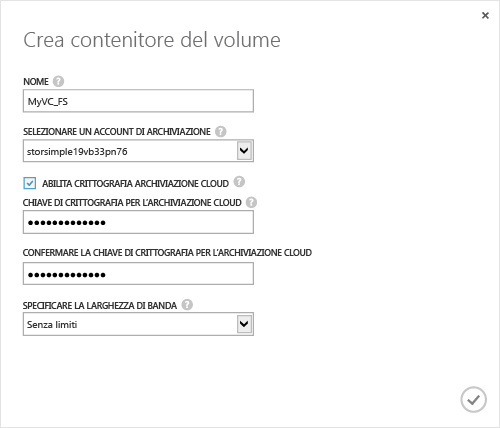

<properties 
   pageTitle="Creare un contenitore di volumi"
   description="Viene descritto come creare un contenitore di volumi in un dispositivo StorSimple."
   services="storsimple"
   documentationCenter="NA"
   authors="SharS"
   manager="adinah"
   editor="tysonn" />
<tags 
   ms.service="storsimple"
   ms.devlang="NA"
   ms.topic="article"
   ms.tgt_pltfrm="NA"
   ms.workload="TBD"
   ms.date="04/01/2015"
   ms.author="v-sharos" />

#### Per creare un contenitore di volumi

1. Nella pagina **Avvio rapido** del dispositivo fare clic su **Aggiungere un contenitore di volumi**. Verrà visualizzata la finestra di dialogo **Crea contenitore di volumi**.

    

2. Nella finestra di dialogo **Crea contenitore di volumi**:
  1. Fornire un **Nome** per il contenitore di volumi. Il nome deve essere lungo da 3 a 32 caratteri.
  2. Selezionare un **Account di archiviazione** da associare a questo contenitore di volumi. È possibile scegliere l'account predefinito generato al momento della creazione del servizio. È inoltre possibile utilizzare l’opzione **Aggiungi nuovo** per specificare un account di archiviazione non collegato a questa sottoscrizione al servizio.
  3. Selezionare **Abilita crittografia archiviazione cloud** per attivare la crittografia dei dati inviati dal dispositivo al cloud.
  4. Fornire e confermare una **Chiave di crittografia archiviazione cloud** lunga da 8 a 32 caratteri. Questa chiave viene utilizzata dal dispositivo per accedere ai dati crittografati.
  5. Selezionare **Illimitata** nell’elenco a discesa **Specifica larghezza di banda** se si desidera utilizzare tutta la larghezza di banda disponibile. È inoltre possibile impostare questa opzione su **Personalizzata** per utilizzare i controlli della larghezza di banda e specificare un valore compreso tra 1 e 1.000 Mbps. Se si dispone delle informazioni sulla larghezza di banda, è possibile allocare la larghezza di banda in base a una pianificazione specificando **Seleziona un modello di larghezza di banda**. Per una procedura dettagliata, vedere [Aggiungere un modello di larghezza di banda](https://msdn.microsoft.com/library/dn757746.aspx#addBT).
  6. Fare clic sull'icona del segno di spunta  per salvare questo contenitore di volumi e chiudere la procedura guidata. 

  Il contenitore di volumi appena creato verrà elencato nella pagina **Contenitori di volumi**.

<!---HONumber=58_postMigration-->