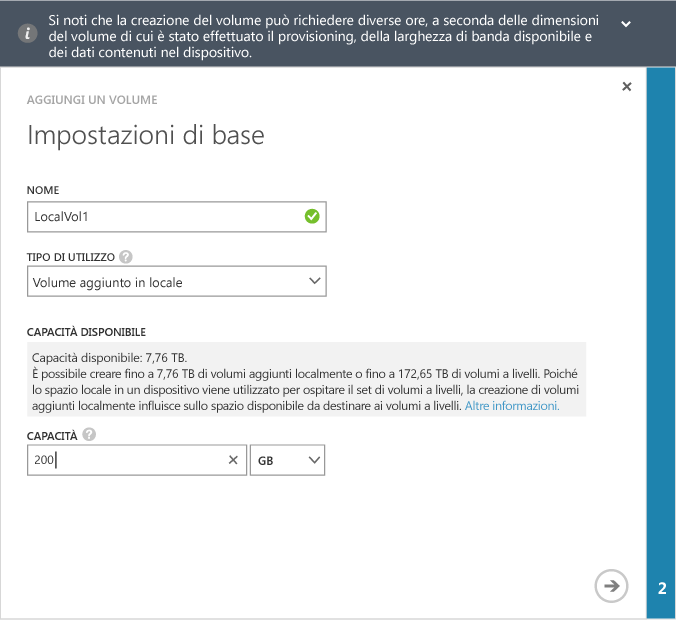
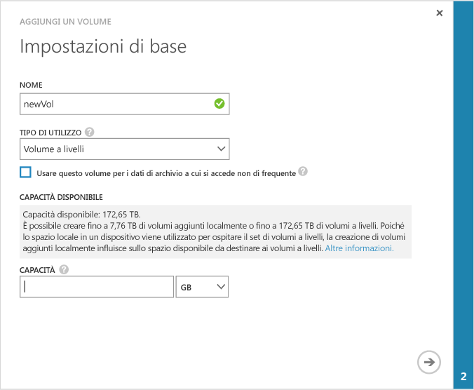

<!--author=alkohli last changed: 08/16/2016-->

#### Per creare un volume
1. Nella pagina **Avvio rapido** del dispositivo fare clic su **Aggiungi un volume** per avviare la procedura guidata corrispondente.
2. Nella procedura guidata Aggiungi volume, in **Impostazioni di base**:
   
   1. Digitare un **Nome** per il volume.
   2. Nell'elenco a discesa selezionare il **Tipo di utilizzo** per il volume. Per carichi di lavoro che richiedono garanzie locali, latenze basse e prestazioni più elevate, selezionare un volume **aggiunto in locale** . Per tutti gli altri dati, selezionare un volume **a livelli** . Se si usa questo volume per dati di archivio, selezionare la casella di controllo **Usare questo volume per i dati di archivio a cui si accede non di frequente**. 
      
       Per un volume aggiunto in locale viene eseguito il thick provisioning, per garantire che i dati primari rimangano a livello locale per il dispositivo e non a livello cloud.  Se si crea un volume aggiunto in locale, il dispositivo cercherà lo spazio disponibile nei livelli locali per il provisioning del volume delle dimensioni richieste. L'operazione di creazione di un volume aggiunto in locale potrebbe comportare la distribuzione dei dati esistenti dal dispositivo al cloud e il tempo impiegato per creare il volume potrebbe essere lungo. Il tempo totale dipende dalle dimensioni del volume di cui è stato eseguito il provisioning, dalla larghezza di banda di rete disponibile e dai dati sul dispositivo. 
      
       Per un volume a livelli viene effettuato il thin provisioning e la creazione può essere rapida. Selezionando **Usare questo volume per i dati di archivio a cui si accede non di frequente** per un volume a livelli interessato da modifiche dei dati di archivio, le dimensioni del blocco di deduplicazione per il volume verranno portate a 512 KB. Se questo campo non è selezionato, il volume a livelli corrispondente utilizzerà dimensioni del blocco pari a 64 KB. Una dimensione maggiore del blocco di deduplicazione consente al dispositivo di accelerare il trasferimento dei dati di archivio di grandi dimensioni nel cloud.
   3. Specificare la **Capacità fornita** per il volume. Prendere nota della capacità disponibile in base al tipo di volume selezionato. Le dimensioni del volume specificato non devono superare lo spazio disponibile.
      
       È possibile effettuare il provisioning di volumi aggiunti in locale fino a 8,5 TB oppure di volumi a livelli fino a 200 TB nel dispositivo 8100. Nel dispositivo 8600 più grande è possibile effettuare il provisioning di volumi aggiunti in locale fino a 22,5 TB o di volumi a livelli fino a 500 TB. Poiché è necessario spazio locale sul dispositivo per ospitare il working set di volumi a livelli, la creazione di volumi aggiunti in locale influirà sullo spazio disponibile per il provisioning di volumi a livelli. Pertanto, creando un volume aggiunto in locale verrà ridotto lo spazio disponibile per la creazione di volumi a livelli. Analogamente, creando un volume a livelli verrà ridotto lo spazio disponibile per la creazione di volumi aggiunti in locale.
      
       Se nel dispositivo 8100 si effettua il provisioning di un volume aggiunto in locale di 8,5 TB, ovvero le dimensioni massime consentite, si esaurisce tutto lo spazio locale disponibile nel dispositivo. Non sarà possibile creare volumi a livelli da quel punto in poi, perché non è disponibile spazio locale sul dispositivo per ospitare il working set del volume a livelli. Anche i volumi a livelli esistenti influiscono sullo spazio disponibile. Ad esempio, se nel dispositivo 8100 sono già presenti volumi a livelli di circa 106 TB, saranno disponibili solo 4 TB di spazio per i volumi aggiunti in locale.
      
       La figura seguente mostra la finestra di dialogo **Impostazioni di base** per un volume aggiunto in locale.
      
        
      
       La figura seguente mostra la finestra di dialogo **Impostazioni di base** per un volume a livelli.
      
        
   
   1. Fare clic sull'icona freccia    per passare alla pagina successiva.
3. Nella finestra di dialogo **Impostazioni aggiuntive** , aggiungere un nuovo record di controllo di accesso (ACR):
   
   1. Fornire un **Nome** per l'ACR.
   2. In **Nome iniziatore iSCSI**, fornire il nome qualificato iSCSI (IQN) dell'host di Windows. Se non si dispone del nome qualificato iSCSI, andare a [Ottenere il nome qualificato iSCSI di un host di Windows Server](#get-the-iqn-of-a-windows-server-host).
   3. Selezionare la casella di controllo **Abilita un criterio di backup predefinito per questo volume******. Il backup predefinito creerà un criterio eseguito alle 22:30 di ogni giorno (ora del dispositivo) e creerà uno snapshot del volume nel cloud.
      
      > [!NOTE]
      > Una volta abilitato qui, il backup non può essere annullato. Sarà necessario modificare il volume per cambiare questa impostazione.
      > 
      > 
      
      
4. Fare clic sull’icona del segno di spunta  . Verrà creato un volume con le impostazioni specificate.

<!--HONumber=Nov16_HO2-->

