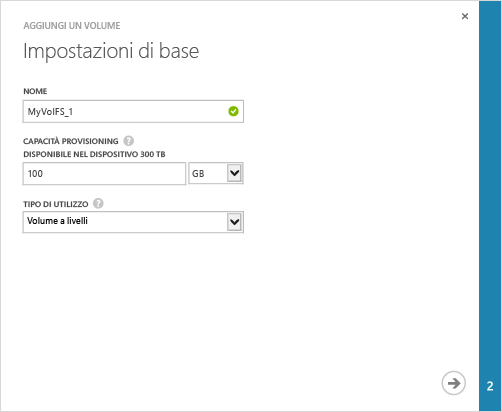

<properties 
   pageTitle="Creare un volume"
   description="Viene illustrato come aggiungere un volume in un dispositivo StorSimple."
   services="storsimple"
   documentationCenter="NA"
   authors="SharS"
   manager="adinah"
   editor="tysonn" /> 
<tags 
   ms.service="storsimple"
   ms.devlang="NA"
   ms.topic="article"
   ms.tgt_pltfrm="NA"
   ms.workload="TBD"
   ms.date="04/28/15"
   ms.author="v-sharos" />

### Per creare un volume

1. Nella pagina **Avvio rapido** del dispositivo fare clic su **Aggiungi un volume**. Verrà avviata la procedura guidata Aggiungi volume.

2. Nella procedura guidata Aggiungi volume, in **Impostazioni di base**:
   1. Digitare un **Nome** per il volume.
   2. Specificare la **Capacità fornita** per il volume. **La capacità del volume deve essere tra 1 GB e 64 TB.**
   3. Nell'elenco a discesa selezionare il **Tipo di utilizzo** per il volume. Per i dati di archiviazione a cui si accede con minore frequenza, selezionare un **Volume di archivio**. Per tutti gli altri tipi di dati, selezionare **Volume principale**.
   4. Fare clic sull'icona freccia  per passare alla pagina successiva.

     

3. Nella finestra di dialogo **Impostazioni aggiuntive**, aggiungere un nuovo record di controllo di accesso \(ACR\):
   1. Fornire un **Nome** per l'ACR.
   2. In **Nome iniziatore iSCSI**, fornire il nome qualificato iSCSI \(IQN\) dell'host di Windows. Se non si dispone del nome qualificato iSCSI, andare a [Ottenere il nome qualificato iSCSI di un host di Windows Server](#get-the-iqn-of-a-windows-server-host).
   3. In **Backup predefinito per questo volume?**, selezionare la casella di controllo **Abilita**. Il backup predefinito creerà un criterio eseguito alle 22:30 di ogni giorno \(ora del dispositivo\) e creerà uno spapshot nel cloud del volume.

     >[AZURE.NOTE]Una volta abilitato qui, il backup non può essere annullato. Sarà necessario modificare il volume per cambiare questa impostazione.

     

4. Fare clic sull'icona del segno di spunta . Verrà creato un volume con le impostazioni specificate.

<!--HONumber=52-->
