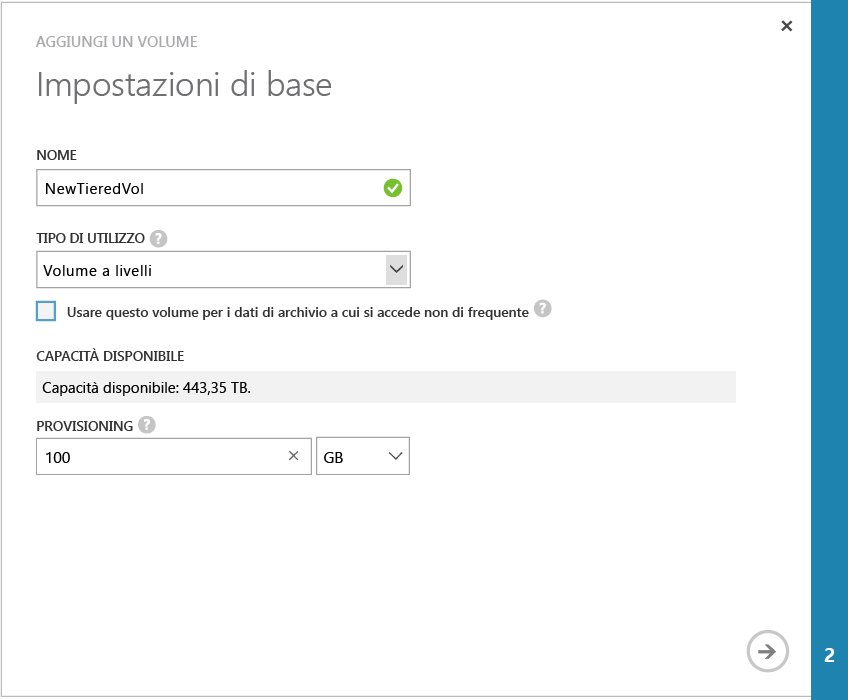

<!--author=SharS last changed: 02/04/2016-->

#### Per creare un volume

1. Nella pagina **Avvio rapido** del dispositivo fare clic su **Aggiungi un volume**. Verrà avviata la procedura guidata Aggiungi volume.

2. Nella procedura guidata Aggiungi un volume, in **Impostazioni di base**, procedere come segue:
   1. Digitare un **Nome** per il volume.
   2. Specificare la **Capacità fornita** per il volume in GB o TB. La capacità del volume deve essere compresa tra 1 GB e 64 TB per un dispositivo fisico.
   3. Nell'elenco a discesa selezionare il **Tipo di utilizzo** per il volume. 
   4. Se si usa questo volume per dati di archivio, selezionare la casella di controllo **Usare questo volume per i dati di archivio a cui si accede non di frequente**. Per tutti gli altri casi, selezionare semplicemente **Volume a livelli**. I volumi a livelli erano in precedenza denominati volumi primari.

        

    4. Fare clic sull'icona freccia  per passare alla pagina successiva.

3. Nella finestra di dialogo **Impostazioni aggiuntive**, aggiungere un nuovo record di controllo di accesso (ACR):
   1. Fornire un **Nome** per l'ACR.
   2. In **Nome iniziatore iSCSI**, fornire il nome qualificato iSCSI (IQN) dell'host di Windows. Se non si dispone del nome qualificato iSCSI, andare a [Ottenere il nome qualificato iSCSI di un host di Windows Server](#get-the-iqn-of-a-windows-server-host).
   3. È consigliabile abilitare un backup predefinito tramite la selezione della casella di controllo **Abilita un criterio di backup predefinito per questo volume**. Il backup predefinito creerà un criterio eseguito alle 22:30 di ogni giorno (ora del dispositivo) e creerà uno spapshot nel cloud del volume.

        > [AZURE.NOTE] Una volta abilitato qui, il backup non può essere annullato. Sarà necessario modificare il volume per cambiare questa impostazione.

        

4. Fare clic sull’icona del segno di spunta . Verrà creato un volume con le impostazioni specificate.

 **Video disponibile**

Per guardare un video che illustra come creare un nuovo volume StorSimple Manager, fare clic [qui](https://azure.microsoft.com/documentation/videos/create-a-storsimple-volume/).

<!----HONumber=AcomDC_0211_2016-->