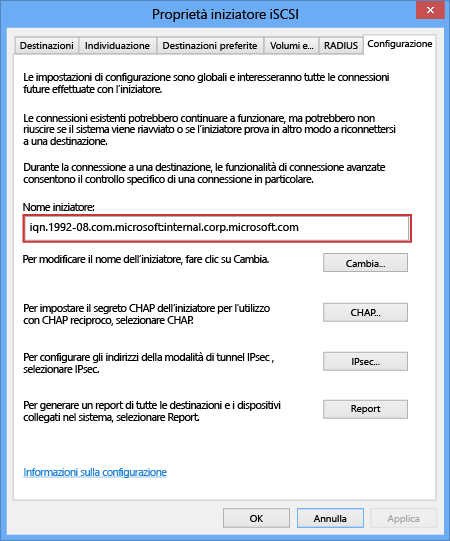

<!--author=SharS last changed: 9/17/15-->

#### Per ottenere il nome qualificato iSCSI di un host di Windows

1. Avviare l'iniziatore iSCSI di Microsoft sull’host di Windows.

2. Nella finestra **Proprietà iniziatore iSCSI**, nella scheda **Configurazione**, selezionare e copiare la stringa dal campo **Nome iniziatore**.
 
    

3. Salvare la stringa.

<!---HONumber=Oct15_HO3-->