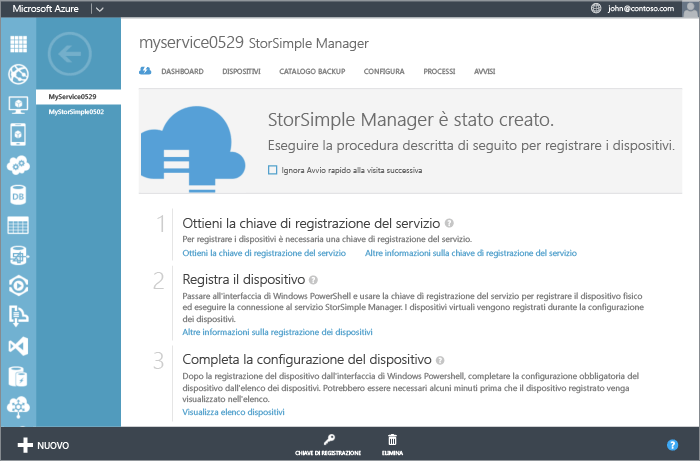
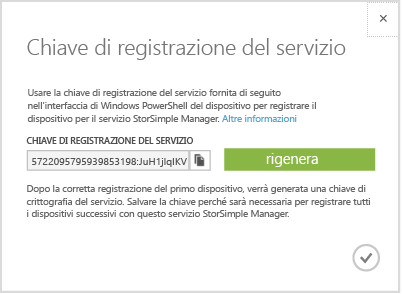

<properties 
   pageTitle="Ottenere la chiave di registrazione del servizio."
   description="Viene illustrato come ottenere la chiave di registrazione utilizzata per registrare tutti i dispositivi StorSimple."
   services="storsimple"
   documentationCenter="NA"
   authors="SharS"
   manager="adinah"
   editor="tysonn" /> 
<tags 
   ms.service="storsimple"
   ms.devlang="NA"
   ms.topic="article"
   ms.tgt_pltfrm="NA"
   ms.workload="TBD"
   ms.date="04/01/2015"
   ms.author="v-sharos" />

### Per ottenere la chiave di registrazione del servizio StorSimple.

1. Nella pagina del **servizio StorSimple Manager**, fare clic sul servizio creato. Verrà visualizzata la pagina **Avvio rapido**. È possibile fare clic sull'icona di avvio rapido  per accedere alla pagina **Avvio rapido** in qualsiasi momento.

     

2. Fare clic su **Ottenere la chiave di registrazione del servizio**. È inoltre possibile fare clic su **Chiave di registrazione** nella parte inferiore della pagina. Sarà necessario attendere alcuni minuti che la chiave venga recuperata. Viene visualizzata la finestra di dialogo **Chiave di registrazione del servizio**.

     

3. Individuare la chiave di registrazione del servizio.

4. Fare clic sull'icona di copia  per copiare la chiave e salvarla per un utilizzo successivo.

5. Fare clic sull'icona del segno di spunta  per chiudere questa finestra di dialogo e tornare alla pagina **Avvio rapido**.

> [AZURE.NOTE]La chiave di registrazione del servizio viene utilizzata per registrare tutti i dispositivi che è necessario registrare con il servizio StorSimple Manager.

 
<!--HONumber=52-->
