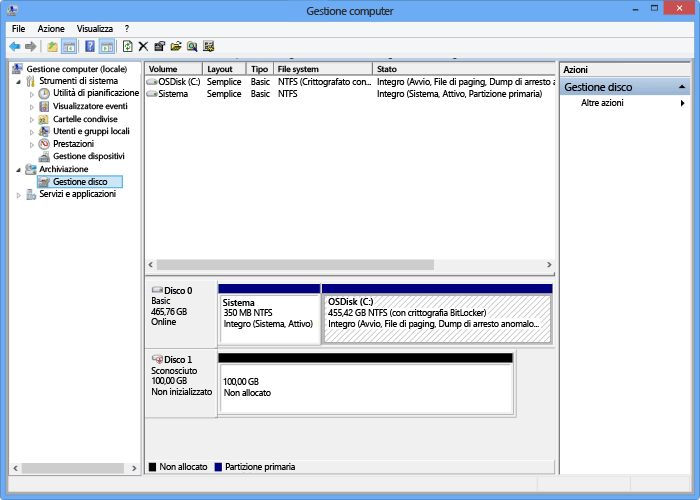

#### Per montare, avviare e formattare un volume
1. Avviare l'iniziatore iSCSI di Microsoft.
2. Nella scheda **Individuazione** della finestra delle **proprietà dell'iniziatore iSCSI** fare clic su **Individua portale**.
3. Nella finestra di dialogo **Individua portale destinazione** specificare l'indirizzo IP dell'interfaccia di rete abilitata per iSCSI e quindi fare clic su **OK**. 
4. Nella scheda **Destinazioni** della finestra delle **proprietà dell'iniziatore iSCSI** individuare **Destinazioni individuate**. Lo stato del dispositivo deve apparire come **Inattivo**.
5. Selezionare il dispositivo di destinazione, quindi fare clic su **Connetti**. Dopo aver connesso il dispositivo, lo stato deve essere modificato in **Connesso**. Per altre informazioni sull'uso dell'iniziatore iSCSI Microsoft, vedere [Installing and Configuring Microsoft iSCSI Initiator][1] (Installazione e configurazione dell'iniziatore iSCSI Microsoft).
6. Nell'host di Windows, premere il tasto Logo Windows + X, quindi fare clic su **Esegui**. 
7. Nella finestra di dialogo **Esegui** digitare **Diskmgmt.msc**. Fare clic su **OK**. Verrà visualizzata la finestra di dialogo **Gestione disco**. Nel riquadro destro vengono visualizzati i volumi sul proprio host.
8. Nella finestra **Gestione disco** i volumi montati vengono visualizzati come mostrato nella figura seguente. Fare clic con il pulsante destro del mouse sul volume individuato (fare clic sul nome del disco), quindi scegliere **Online**.
   
      
9. Fare clic con il pulsante destro del mouse sul volume (fare clic sul nome del disco), quindi scegliere **Inizializza**.
10. Per formattare un volume semplice, attenersi alla seguente procedura:
    
    1. Fare clic con il pulsante del mouse sul volume dopo averlo selezionato (fare clic sull'area a destra), quindi scegliere **Nuovo volume semplice**.
    2. Nella procedura guidata Nuovo volume semplice, specificare la dimensione del volume e la lettera di unità, quindi configurare il volume come file system NTFS.
    3. Specificare una dimensione unità di allocazione pari a 64 KB. Queste dimensioni unità di allocazione funzionano correttamente con gli algoritmi di deduplicazione utilizzati nella soluzione StorSimple.
    4. Eseguire una formattazione veloce.

 **Video disponibile**

Per guardare un video che illustra come montare, inizializzare, e formattare un volume StorSimple, fare clic [qui](https://azure.microsoft.com/documentation/videos/mount-initialize-and-format-a-storsimple-volume/).

<!--Link references-->
[1]: /previous-versions/windows/it-pro/windows-server-2008-R2-and-2008/ee338480(v=ws.10)