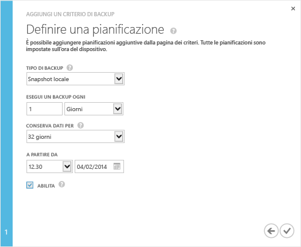

### Per eseguire un backup

1. Nella pagina **Guida introduttiva** del dispositivo, fare clic su **Aggiungi criterio di backup**. L’operazione consentirà di avviare la procedura guidata per aggiungere un criterio di backup. 

2. Nella pagina **Definisci criterio di backup**:
  1. Fornire un nome per il criterio di backup, che contenga tra i 3 e i 150 caratteri.
  2. Selezionare i volumi su cui eseguire il backup. Se si seleziona più di un volume, questi volumi verranno raggruppati per creare un backup crash-consistent.
  3. Fare clic sull’icona a forma di freccia . 
  
    

3. Nella pagina **Definisci pianificazione**:
  1. Selezionare il tipo di backup dall’elenco a discesa. Per ripristini più rapidi, selezionare **Snapshot locale**. Per la resilienza dei dati, selezionare **Snapshot cloud**.
  2. Specificare la frequenza di backup in minuti, ore, giorni o settimane.
  3. Selezionare un periodo di conservazione. Le scelte di conservazione dipendono dalla frequenza di backup. Ad esempio, per un criterio giornaliero, la conservazione può essere specificata in settimane, mentre la conservazione per un criterio mensile è specificata in mesi.
  4. Selezionare la data e l’ora di inizio per il criterio di backup.
  5. Selezionare la casella di controllo **Abilita** per abilitare il criterio di backup. 
  6. Fare clic sull’icona del segno del spunta  per salvare il criterio.

    
 
     A questo punto è disponibile un criterio di backup che creerà backup pianificati dei dati del volume.

La configurazione del dispositivo è stata completata.

<!---HONumber=July15_HO4-->