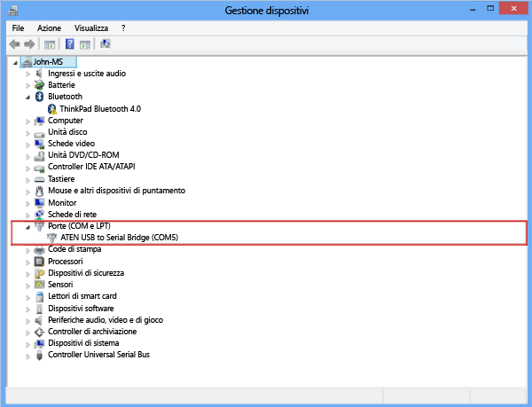
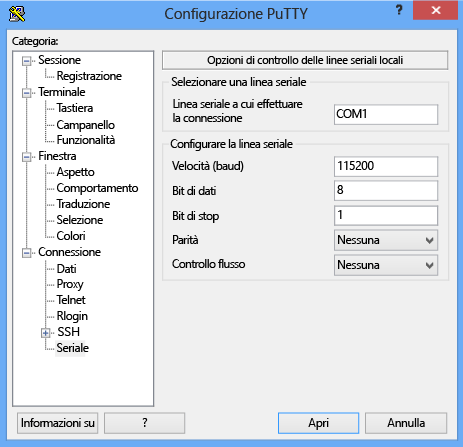

<!--author=SharS last changed: 9/17/15-->

#### Per connettersi tramite console seriale
1. Collegare il cavo seriale al dispositivo (direttamente o tramite un adattatore seriale USB).
2. Aprire il **Pannello di controllo**, quindi aprire **Gestione dispositivi**.
3. Identificare la porta COM, come illustrato nella figura seguente.
   
     
4. Avviare PuTTY.
5. Nel riquadro destro, modificare **Tipo di connessione** su **Seriale**.
6. Nel riquadro di destra, digitare la porta COM appropriata. Assicurarsi che i parametri di configurazione seriale siano impostati come indicato di seguito:
   
   * Velocità: 115.200
   * Bit di dati: 8
   * Bit di stop: 1
   * Parità: nessuno
   * Controllo di flusso: nessuno
     
     Queste impostazioni sono mostrate nella figura seguente.
     
     
     
     > [!NOTE]
     > Se l'impostazione del controllo di flusso predefinito non funziona, provare a impostare il controllo di flusso su XON/XOFF.
     > 
     > 
7. Fare clic su **Apri** per avviare una sessione seriale.

<!---HONumber=Oct15_HO3-->