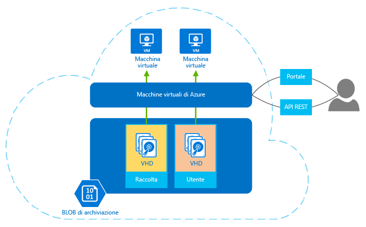

## Informazioni sulle macchine virtuali
La funzionalità Macchine virtuali di Azure consente di creare e usare macchine virtuali nel cloud. Offrendo il cosiddetto approccio *IaaS (infrastruttura distribuita come servizio)*, questa tecnologia può essere usata in diversi modi. Di seguito sono riportati alcuni esempi:

* **Macchine virtuali (VM) per lo sviluppo e il testing.** I gruppi di sviluppo in genere usano le macchine virtuali perché consentono di creare in modo semplice e rapido un computer con configurazioni specifiche necessarie per scrivere il codice e testare un'applicazione. Macchine virtuali di Azure fornisce un modo facile e conveniente per creare tali macchine virtuali, usarle ed eliminarle quando non sono più necessarie.
* **Esecuzione di applicazioni nel cloud.** L'esecuzione nel cloud pubblico risulta economicamente vantaggiosa per alcune applicazioni, ad esempio per un'applicazione con picchi elevati a livello di domanda. Benché sia possibile dotare il proprio data center di hardware sufficiente a far fronte a questi picchi, è probabile che la maggior parte di tale hardware venga sottoutilizzato per molto tempo. L'esecuzione di un'applicazione di questo tipo in Azure consente di pagare le macchine virtuali aggiuntive solo quando sono necessarie e di arrestarle al termine del picco nella domanda. Oppure si immagini uno scenario in cui una start-up necessita di risorse di elaborazione su richiesta in modo rapido e senza impegno di acquisto. Anche in questo caso Azure può rappresentare la scelta giusta.
* **Estensione del data center nel cloud pubblico.** Quando si usa Rete virtuale di Azure, l'organizzazione può creare una rete virtuale (VNET) come estensione della rete locale e aggiungervi macchine virtuali. Sarà quindi possibile eseguire applicazioni come [SharePoint](../articles/virtual-machines/virtual-machines-windows-sharepoint-farm.md?toc=%2fazure%2fvirtual-machines%2fwindows%2ftoc.json), [SQL Server](../articles/virtual-machines/windows/sql/virtual-machines-windows-sql-server-iaas-overview.md) e altre ancora in una VM di Azure. Tale approccio potrebbe essere più semplice da distribuire o meno costoso rispetto all'esecuzione delle applicazioni nelle macchine virtuali del proprio data center.   
* **Ripristino di emergenza.** Invece di effettuare pagamenti continui per un data center di backup usato raramente, il ripristino di emergenza basato su IaaS consente di pagare le risorse di elaborazione necessarie solo quando servono effettivamente.  Ad esempio, se il funzionamento del data center primario si interrompe, è possibile creare macchine virtuali in Azure per eseguire le applicazioni essenziali, quindi chiuderle quando non sono più necessarie.

Come le altre macchine virtuali, una macchina virtuale di Azure dispone di un sistema operativo e di funzionalità di archiviazione e connessione di rete e può eseguire una vasta gamma di applicazioni. È possibile usare un'immagine fornita da Azure o da uno dei relativi partner oppure usare un'immagine personalizzata. Gli esempi includono diverse versioni, edizioni e configurazioni di:

* Server Linux quali Suse, Ubuntu e CentOS
* Windows Server 
* SQL Server
* BizTalk Server 
* SharePoint Server

Le macchine virtuali usano dischi rigidi virtuali (VHD) per archiviare il sistema operativo e i dati. Tali dischi vengono usati anche per le immagini che è possibile scegliere per installare un sistema operativo. La figura seguente illustra questi usi e due degli strumenti per la creazione e la gestione delle macchine virtuali.

**Figura: in Macchine virtuali di Azure è disponibile l'approccio IaaS (infrastruttura distribuita come servizio).**

Le macchine virtuali possono essere gestite mediante un portale basato su browser, gli strumenti da riga di comando con il supporto per gli script o direttamente tramite l'API REST. Anche i partner Microsoft, ad esempio RightScale e ScaleXtreme, offrono servizi di gestione basati sull'API REST. 

Oltre al sistema operativo, le altre scelte di configurazione disponibili con le macchine virtuali includono quanto segue:

* La dimensione, che determina fattori come il numero di dischi che è possibile collegare e la potenza di elaborazione. Azure offre una vasta gamma di dimensioni per supportare molti tipi di uso. Per informazioni dettagliate, vedere [Dimensioni delle macchine virtuali](../articles/virtual-machines/virtual-machines-linux-sizes.md?toc=%2fazure%2fvirtual-machines%2flinux%2ftoc.json).  
* L'area di Azure in cui verrà ospitata la nuova macchina virtuale, ad esempio Stati Uniti, Europa o Asia. 
* Le estensioni VM, che conferiscono alla macchina virtuale funzionalità aggiuntive, tra cui l'esecuzione di un antivirus o l'uso della funzionalità DSC (Desired State Configuration) di Windows PowerShell.

Altri vantaggi da considerare per le macchine virtuali sono i seguenti:

**Pagamento in base al consumo**. Azure addebita una tariffa oraria in base alle dimensioni e al sistema operativo della VM. Per le ore parziali, Azure addebita il costo solo dei minuti usati. I costi di archiviazione vengono determinati e addebitati separatamente. Per informazioni dettagliate, vedere [Prezzi di Macchine virtuali](https://azure.microsoft.com/pricing/details/virtual-machines/).

**Resilienza**. Azure monitora l'hardware fisico che ospita ogni VM in esecuzione. Se si verifica un problema su un server fisico che esegue una macchina virtuale, Azure rileva il problema, sposta la macchina virtuale su nuovo hardware e quindi la riavvia. Questo processo a volte viene indicato come correzione del servizio. Azure inoltre protegge i dati di una macchina virtuale mantenendo copie ridondanti dei dischi rigidi virtuali nell'archivio BLOB. 

<!--HONumber=Jan17_HO2-->

