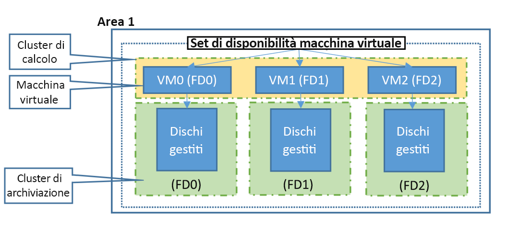

This article provides you with an overview of the availability features of Azure virtual machines (VMs).

## Disponibilità elevata

Workloads are typically spread across different virtual machines to gain high throughput, performance, and to create redundancy in case a VM is impacted due to an update or other event. 

There are few options that Azure provides to achieve High Availability. First let’s talk about basic constructs. 

### Zone di disponibilità

[Availability zones](../articles/availability-zones/az-overview.md) expand the level of control you have to maintain the availability of the applications and data on your VMs. An Availability Zone is a physically separate zone, within an Azure region. Esistono tre zone di disponibilità per ogni area di Azure supportata. 

Ogni zona di disponibilità può contare su risorse di alimentazione, rete e raffreddamento a sé. Progettando le soluzioni in modo che usino VM replicate nelle zone, è possibile proteggere app e dati dalla perdita di un data center. Se una zona è compromessa, le app e i dati replicati diventano immediatamente disponibili in un'altra zona. 

Altre informazioni sulla distribuzione di una macchina virtuale [Windows](../articles/virtual-machines/windows/create-powershell-availability-zone.md) o [Linux](../articles/virtual-machines/linux/create-cli-availability-zone.md) in una zona di disponibilità.

### Domini di errore

Un dominio di errore è un raggruppamento logico di tutto l'hardware sottostante che condivide una fonte di alimentazione e uno switch di rete comuni, come a un rack in un datacenter locale. 

### Domini di aggiornamento

Un dominio di aggiornamento è un gruppo logico di hardware sottostante che può essere sottoposto a manutenzione oppure riavviato nello stesso momento. 

Questo approccio garantisce che almeno un'istanza dell'applicazione rimanga in esecuzione durante gli interventi di manutenzione periodica della piattaforma Azure. The order of update domains being rebooted may not proceed sequentially during maintenance, but only one update domain is rebooted at a time.

## Set di scalabilità di macchine virtuali 

Azure virtual machine scale sets let you create and manage a group of load balanced VMs. Il numero di istanze di macchine virtuali può aumentare o diminuire automaticamente in risposta alla domanda o a una pianificazione definita. Scale sets provide high availability to your applications, and allow you to centrally manage, configure, and update many VMs. We recommended that two or more VMs are created within a scale set to provide for a highly available application and to meet the [99.95% Azure SLA](https://azure.microsoft.com/support/legal/sla/virtual-machines/). There is no cost for the scale set itself, you only pay for each VM instance that you create. Quando una sola macchina virtuale usa le [unità SSD Premium di Azure](https://docs.microsoft.com/azure/virtual-machines/windows/disks-types#premium-ssd), per gli eventi di manutenzione non pianificati viene applicato il Contratto di servizio di Azure. Virtual machines in a scale set can be deployed across multiple update domains and fault domains to maximize availability and resilience to outages due to data center outages, and planned or unplanned maintenance events. Virtual machines in a scale set can also be deployed into a single Availability zone, or regionally. Availability zone deployment options may differ based on the orchestration mode.

### Preview: Orchestration mode Preview
Virtual machines scale sets allow you to specify orchestration mode.  With the virtual machine scale set orchestration mode (preview), you can now choose whether the scale set should orchestrate virtual machines which are created explicitly outside of a scale set configuration model, or virtual machine instances created implicitly based on the configuration model. Choose the orchestration mode that VM orchestration model allows you group explicitly defined Virtual Machines together in a region or in an availability zone. Virtual machines deployed in an Availability Zone provides zonal isolation to VMs are they are bound to the availability zone boundary and are not subjected to any failures that may occur in other availability zone in the region. 

|   | “orchestrationMode”: “VM” (VirtualMachine)| “orchestrationMode”: “ScaleSetVM” (VirtualMachineScaleSetVM) |
|----|----|----|
| VM configuration model| None. VirtualMachineProfile is undefined in the scale set model. | Richiesto. VirtualMachineProfile is populated in the scale set model. |
| Adding new VM to Scale Set| VMs are explicitly added to the scale set when the VM is created. | VMs are implicitly created and added to the scale set based on the VM configuration model, instance count, and AutoScaling rules. |
| Zone di disponibilità| Supports regional deployment or VMs in one Availability Zone| Supports regional deployment or multiple Availability Zones; Can define the zone balancing strategy |
| Domini di errore| Can define fault domains count. 2 or 3 based on regional support and 5 for Availability zone. The assigned VM fault domain will persist with VM lifecycle, including deallocate and restart. | Can define 1, 2, or 3 fault domains for non-zonal deployments, and 5 for Availability zone deployments. The assigned VM fault domain does not persist with VM lifecycle, virtual machines are assigned a fault domain at time of allocation. |
| Domini di aggiornamento| N/D. Update domains are automatically mapped to fault domains| N/D. Update domains are automatically mapped to fault domains |

**Fault domains and update domains**

Virtual machine scale sets simplify designing for high availability by aligning fault domains and update domains. You will only have to define fault domains count for the scale set. The number of fault domains available to the scale sets may vary by region. See [Number of Fault Domains per region](https://docs.microsoft.com/azure/virtual-machines/windows/manage-availability#number-of-fault-domains-per-region).

## Set di disponibilità
Un set di disponibilità è un raggruppamento logico di macchine virtuali in un data center che consente ad Azure di comprendere come è compilata l'applicazione per garantirne la ridondanza e la disponibilità. È consigliabile creare due o più macchine virtuali in un set di disponibilità, per garantire un'elevata disponibilità dell'applicazione e raggiungere il [99,95% di disponibilità previsto dal contratto di servizio di Azure](https://azure.microsoft.com/support/legal/sla/virtual-machines/). Non è previsto alcun costo per il set di disponibilità, si paga solo per ogni istanza di macchina virtuale creata. Quando una sola macchina virtuale usa le [unità SSD Premium di Azure](../articles/virtual-machines/windows/disks-types.md#premium-ssd), per gli eventi di manutenzione non pianificati viene applicato il Contratto di servizio di Azure.

In an availability set, VMs are automatically distributed across these fault domains. Questo approccio consente di limitare l'impatto di eventuali guasti dell'hardware fisico, interruzioni di rete o interruzioni dell'alimentazione.

Le VM che usano [Azure Managed Disks](../articles/virtual-machines/windows/faq-for-disks.md) sono allineate con i domini di errore dei dischi gestiti quando si usa un set di disponibilità gestito. Questo allineamento garantisce che tutti i dischi gestiti collegati a una VM siano nello stesso dominio di errore dei dischi gestiti. 

In un set di disponibilità gestito possono essere create solo VM con dischi gestiti. Il numero di domini di errore dei dischi gestiti varia in base all'area: due o tre domini di errore di dischi gestiti per area. Sono disponibili altre informazioni su questi domini di errore dei dischi gestiti per le [VM Linux](../articles/virtual-machines/linux/manage-availability.md?#use-managed-disks-for-vms-in-an-availability-set) o le [VM Windows](../articles/virtual-machines/windows/manage-availability.md?#use-managed-disks-for-vms-in-an-availability-set).

VMs within an availability set are also automatically distributed across update domains. 

## Passaggi successivi
Ora è possibile iniziare a usare le funzionalità di ridondanza e disponibilità per compilare l'ambiente Azure. Per altre informazioni, vedere le [procedure consigliate per la disponibilità di Azure](/azure/architecture/checklist/resiliency-per-service).

