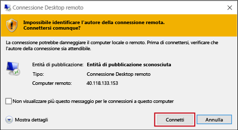
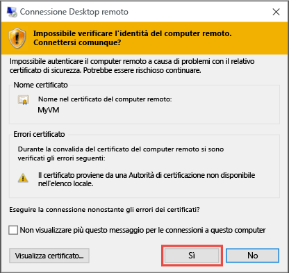

1. Facendo clic su **Connetti** si crea e si scarica un file Remote Desktop Protocol (file con estensione rdp). Fare clic su **Apri** per utilizzare questo file.
2. Verrà visualizzato un avviso che indica che l'autore del file con estensione `.rdp` è sconosciuto. Si tratta di una situazione normale. Nella finestra di Desktop remoto, fare clic su **Connetti** per continuare.
   
    
3. Nella finestra **Sicurezza di Windows** selezionare **Altre opzioni** e quindi **Usa un altro account**. Digitare le credenziali di un account della macchina virtuale e quindi fare clic su **OK**.
   
     **Account locale** : corrisponde in genere al nome utente e alla password dell'account locale specificati al momento della creazione della macchina virtuale. In questo caso, il dominio è il nome della macchina virtuale e viene immesso come *nomevm*&#92;*nomeutente*.  
   
    **VM aggiunta a un dominio**: se la VM appartiene a un dominio, immettere il nome utente con formato *Dominio*&amp;#92;*Nomeutente*. L'account deve anche appartenere al gruppo degli amministratori o deve possedere privilegi di accesso remoto alla VM.
   
    **Controller di dominio** : se la macchina virtuale è un controller di dominio, digitare nome utente e password di un account amministratore di dominio per tale dominio.
4. Fare clic su **Sì** per verificare l'identità della macchina virtuale e terminare la procedura di accesso.
   
   

