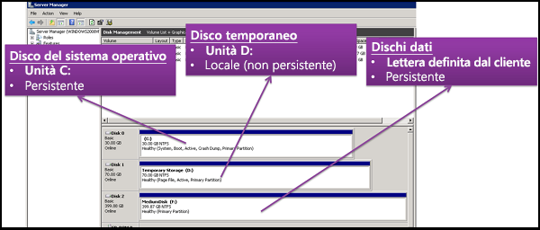

## Vantaggi dei dischi gestiti

Verranno ora esaminati alcuni dei vantaggi legati all'uso dei dischi gestiti.

### Elevati livelli di durabilità e disponibilità

I dischi gestiti sono stati progettati per il 99,999% di disponibilità. I dischi gestiti ottengono questo risultato grazie a tre repliche dei dati, che consentono di garantire una durabilità elevata. In caso di problemi con una o addirittura due repliche, le repliche rimanenti contribuiscono ad assicurare la persistenza dei dati e una tolleranza di errore elevata. Questa architettura ha consentito ad Azure di offrire costantemente durabilità di livello aziendale per i dischi Infrastruttura distribuita come servizio (IaaS, Infrastructure as a Service), con una percentuale di frequenza errori annualizzata pari a ZERO, la migliore del settore.

### Distribuzione semplice e scalabile di macchine virtuali

L'uso dei dischi gestiti permette di creare fino a 50.000 **dischi** di macchine virtuali di un tipo in una sottoscrizione per ogni area, consentendo di creare migliaia di **macchine virtuali** in una singola sottoscrizione. Questa funzionalità aumenta ulteriormente la scalabilità dei [set di scalabilità di macchine virtuali](../articles/virtual-machine-scale-sets/virtual-machine-scale-sets-overview.md), permettendo di creare fino a mille macchine virtuali in un set di scalabilità di macchine virtuali con un'immagine del Marketplace.

### Integrazione con set di disponibilità

I dischi gestiti vengono integrati con una maggiore affidabilità per i set di disponibilità, così che i dischi delle [macchine virtuali in un set di disponibilità](../articles/virtual-machines/windows/manage-availability.md#use-managed-disks-for-vms-in-an-availability-set) siano sufficientemente isolati gli uni dagli altri per evitare singoli punti di errore. I dischi vengono automaticamente posizionati in unità di scala di archiviazione diverse (timbri). Se uno stamp non riesce a causa di un errore hardware o software, hanno esito negativo solo le istanze delle macchine virtuali con dischi in tali stamp. Si prenda ad esempio un'applicazione in esecuzione in cinque macchine virtuali, a loro volta inserite in un set di disponibilità. I dischi di tali macchine virtuali non vengono tutti archiviati nello stesso stamp. In caso di inattività di uno stamp, quindi, le altre istanze dell'applicazione continuano l'esecuzione.

### Integrazione con le zone di disponibilità

Supporta i dischi gestiti [zone di disponibilità](../articles/availability-zones/az-overview.md), che è un'offerta a disponibilità elevata che protegge le applicazioni da errori dei Data Center. Le zone di disponibilità sono località fisiche esclusive all'interno di un'area di Azure. Ogni zona è costituita da uno o più data center dotati di impianti indipendenti per l'alimentazione, il raffreddamento e la connettività di rete. Per garantire la resilienza, sono presenti almeno tre zone separate in tutte le aree abilitate. Con le zone di disponibilità, Azure offre un contratto di servizio con tempo di attività delle VM del 99,99% tra i migliori del settore.

### Supporto di Backup di Azure

Per proteggersi da emergenze a livello di area, [Backup di Azure](../articles/backup/backup-introduction-to-azure-backup.md) può essere usato per creare un processo di backup con backup pianificati e criteri di conservazione dei backup. Ciò consente di eseguire semplici operazioni di ripristino delle macchine virtuali in base alle esigenze. Attualmente Backup di Azure supporta dimensioni di disco fino a quattro tebibyte (TiB). Per altre informazioni, vedere [Uso delle macchine virtuali con dischi gestiti con Backup di Azure](../articles/backup/backup-introduction-to-azure-backup.md#using-managed-disk-vms-with-azure-backup).

### Controllo di accesso granulare

Per assegnare autorizzazioni specifiche per un disco gestito a uno o più utenti, è possibile usare il [controllo degli accessi in base al ruolo di Azure](../articles/role-based-access-control/overview.md). I dischi gestiti espongono una serie di operazioni, inclusa la lettura, la scrittura (creazione/aggiornamento), l'eliminazione e il recupero di un [URI di firma di accesso condiviso](../articles/storage/common/storage-dotnet-shared-access-signature-part-1.md) per il disco. È possibile consentire l'accesso solo alle operazioni che servono agli utenti per svolgere il proprio lavoro. Ad esempio, per fare in modo che un utente non possa copiare un disco gestito in un account di archiviazione, è possibile scegliere di non consentire l'accesso all'operazione di esportazione di tale disco gestito. Analogamente, per fare in modo che un utente non possa usare un URI di firma di accesso condiviso per copiare un disco gestito, è possibile scegliere di non concedere l'autorizzazione per il disco gestito.

## Ruoli del disco

Sono disponibili tre ruoli principali del disco in Azure: il disco dati, il disco del sistema operativo e il disco temporaneo. Questi ruoli corrispondono ai dischi collegati alla macchina virtuale.

### Disco dati

Un disco dati è un disco gestito collegato a una macchina virtuale per archiviare i dati delle applicazioni o altri dati che è necessario conservare. I dischi dati vengono registrati come unità SCSI ed etichettati con una lettera di propria scelta. Ogni disco dati ha una capacità massima di 32.767 gibibyte (GiB). Le dimensioni della macchina virtuale determinano il numero di dischi dati è possibile collegare e il tipo di archiviazione che è possibile utilizzare per ospitare i dischi.

### Disco del sistema operativo

Tutte le macchine virtuali dispongono di un disco del sistema operativo collegato. Il disco del sistema operativo che dispone di un sistema operativo preinstallato, selezionato quando è stata creata la macchina virtuale.

Questo disco ha una capacità massima di 2,048 GiB.

### Disco temporaneo

Ogni macchina virtuale contiene un disco temporaneo che non è un disco gestito. Il disco temporaneo offre archiviazione a breve termine per applicazioni e processi ed è destinato solo all'archiviazione di dati come file di paging o di scambio. I dati nel disco temporaneo potrebbero andare persi durante un [evento di manutenzione](../articles/virtual-machines/windows/manage-availability.md?toc=%2fazure%2fvirtual-machines%2fwindows%2ftoc.json#understand-vm-reboots---maintenance-vs-downtime) evento o quando si [ridistribuire una VM](../articles/virtual-machines/troubleshooting/redeploy-to-new-node-windows.md?toc=%2Fazure%2Fvirtual-machines%2Fwindows%2Ftoc.json). Nelle macchine virtuali Linux di Azure, il disco temporaneo è /dev/sdb per impostazione predefinita e nelle macchine virtuali Windows il disco temporaneo è e:. per impostazione predefinita. Durante un riavvio standard ha esito positivo della macchina virtuale, i dati nel disco temporaneo verranno mantenuti.

## Snapshot dei dischi gestiti

Uno snapshot del disco gestito è una copia di sola lettura di un disco gestito che viene archiviata come disco gestito Standard per impostazione predefinita. Gli snapshot permettono di eseguire il backup dei dischi gestiti in qualsiasi momento. Questi snapshot esistono indipendentemente dal disco di origine e possono essere usati per creare nuove istanze di dischi gestiti. Vengano addebitati in funzione della dimensione usata. Ad esempio, se si crea uno snapshot di un disco gestito con una capacità di provisioning di 64 GiB e una dimensione di dati effettivamente usata di 10 GiB, viene addebitato solo lo snapshot relativo alla dimensione di dati usata di 10 GiB.  

Per altre informazioni su come creare snapshot con dischi gestiti, vedere le risorse seguenti:

* [Creare una copia del disco rigido virtuale archiviato come disco gestito usando gli snapshot in Windows](../articles/virtual-machines/windows/snapshot-copy-managed-disk.md)
* [Creare una copia del disco rigido virtuale archiviato come disco gestito usando gli snapshot in Linux](../articles/virtual-machines/linux/snapshot-copy-managed-disk.md)

### Immagini

I dischi gestiti supportano anche la creazione di un'immagine personalizzata gestita. È possibile creare un'immagine dal disco rigido virtuale personalizzato in un account di archiviazione oppure direttamente da una macchina virtuale (preparata con Sysprep) generalizzata. Questo processo acquisisce una singola immagine. Tutti i dischi gestiti associati a una macchina virtuale, inclusi i dischi dati e del sistema operativo, vengono inclusi in un'unica immagine. Questa immagine personalizzata gestita permette di creare centinaia di macchine virtuali usando l'immagine personalizzata senza dover copiare o gestire alcun account di archiviazione.

Per informazioni sulla creazione di immagini, vedere gli articoli seguenti:

* [Come acquisire un'immagine gestita di una macchina virtuale generalizzata in Azure](../articles/virtual-machines/windows/capture-image-resource.md)
* [Come generalizzare e acquisire una macchina virtuale Linux con l'interfaccia della riga di comando di Azure](../articles/virtual-machines/linux/capture-image.md)

#### Immagini e snapshot

È importante comprendere la differenza tra immagini e snapshot. I dischi gestiti permettono di acquisire l'immagine di una macchina virtuale generalizzata che è stata deallocata. Tale immagine include tutti i dischi collegati alla macchina virtuale e può essere usata per creare una macchina virtuale, che include tutti i dischi.

Uno snapshot è la copia di un disco nel momento in cui lo snapshot viene creato e si applica esclusivamente a un disco. Se la macchina virtuale include un disco, quello del sistema operativo, è possibile creare uno snapshot o acquisire un'immagine del disco e creare una macchina virtuale dallo snapshot o dall'immagine.

Lo snapshot non dispone di alcuna consapevolezza relativa ai dischi, tranne quello che contiene. Questo lo rende problematico da usare negli scenari che richiedono il coordinamento di più dischi, ad esempio lo striping. Gli snapshot dovrebbero essere in grado di coordinarsi tra loro, tuttavia questa funzionalità non è attualmente supportata.

## Passaggi successivi

Nell'articolo sui tipi di disco, altre informazioni sui tipi di disco singolo offerti da Azure e su quale tipo è una scelta ideale per le proprie esigenze.
