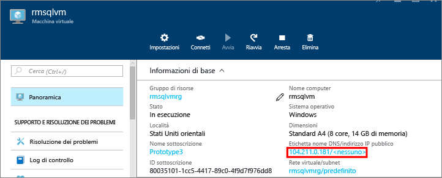
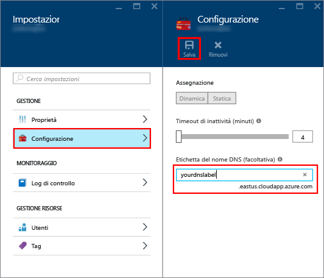

### Configurare un'etichetta DNS per l'indirizzo IP pubblico

Per connettersi al motore di database di SQL Server da Internet, è innanzitutto necessario configurare un'etichetta DNS per l'indirizzo IP pubblico. Si noti che questo passaggio non è necessario se si intende connettersi solo all'istanza di SQL Server presente nella stessa rete virtuale o solo in locale.

Per creare un'etichetta DNS, selezionare in primo luogo **Macchine virtuali** nel portale. Selezionare la propria macchina virtuale di SQL Server per visualizzarne le proprietà.

1. Nel pannello della macchina virtuale selezionare l'**indirizzo IP pubblico.**

	

2. Nelle proprietà dell'indirizzo IP pubblico, espandere **Configurazione**.

3. Immettere un nome per l'etichetta DNS. Si tratta di un record di tipo A che consente di connettersi alla macchina virtuale di SQL Server direttamente per nome, anziché tramite l'indirizzo IP.

	

### Eseguire la connessione al motore di database da un altro computer
 
1. In un computer connesso a Internet aprire SQL Server Management Studio (SSMS).

2. Nella finestra di dialogo **Connetti al server** o **Connetti al motore di database**, nella casella **Nome server**, immettere il nome DNS completo della macchina virtuale (determinato nell'attività precedente).

3. Nella casella **Autenticazione** selezionare **Autenticazione di SQL Server**.

5. Nella casella **Nome account di accesso** digitare un nome di accesso SQL valido.

6. Nella casella **Password** digitare la password dell'account di accesso.

7. Fare clic su **Connect**.

	

<!---HONumber=AcomDC_0107_2016-->